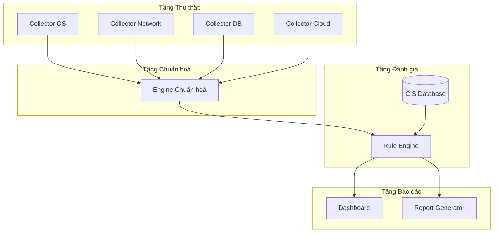
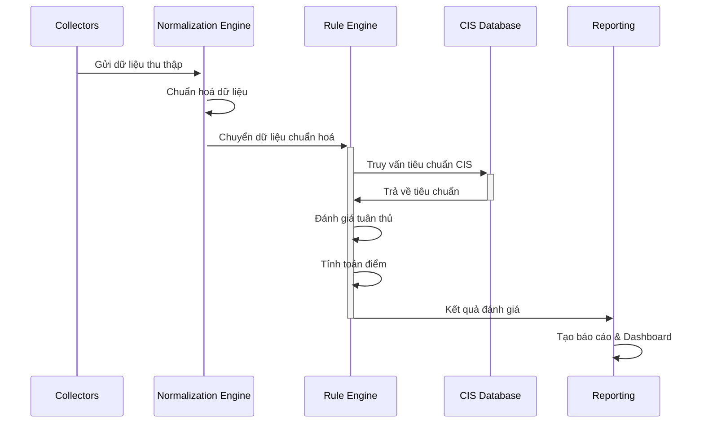

# Thiết kế công cụ tự động hoá Security Audit theo CIS Benchmark

## Kiến trúc tổng thể



## Các thành phần chính

### 1. Tầng Thu thập (Collection Layer)
- **Collectors chuyên biệt** cho từng loại hệ thống:
  - OS Collectors (Windows, Linux, macOS)
  - Network Collectors (Cisco, Juniper, Fortinet)
  - Database Collectors (MySQL, PostgreSQL, Oracle, MSSQL)
  - Cloud Collectors (AWS, Azure, GCP)
- **Chuẩn hoá ngay tại nguồn**: Mỗi collector xuất ra dữ liệu theo định dạng chuẩn (JSON hoặc YAML) với cấu trúc thống nhất

### 2. Tầng Chuẩn hoá (Normalization Layer)
- **Engine chuẩn hoá**: Chuyển đổi tất cả kết quả thu thập vào một mô hình dữ liệu chung
- **Mô hình dữ liệu chung**:
  ```
  {
    "system_id": "unique_identifier",
    "system_type": "os/network/database/cloud",
    "check_items": [
      {
        "control_id": "CIS-XX-YY-ZZ",
        "title": "Tên kiểm tra",
        "current_value": "Giá trị hiện tại",
        "expected_value": "Giá trị mong đợi",
        "raw_data": "Dữ liệu thô thu thập được"
      }
    ]
  }
  ```

### 3. Tầng Đánh giá (Evaluation Layer)
- **CIS Database**: Cơ sở dữ liệu các tiêu chuẩn CIS theo phiên bản, hỗ trợ quản lý phiên bản
- **Rule Engine**: 
  - Đánh giá dữ liệu thu thập dựa trên quy tắc
  - Tính điểm tuân thủ
  - Hỗ trợ quy tắc tùy chỉnh và ngoại lệ

### 4. Tầng Báo cáo (Reporting Layer)
- **Dashboard** hiển thị mức độ tuân thủ tổng thể
- **Chi tiết báo cáo**: Liệt kê các phát hiện theo mức độ nghiêm trọng
- **Khuyến nghị khắc phục**: Hướng dẫn cụ thể cho từng vấn đề
- **Phân tích xu hướng**: So sánh kết quả qua thời gian

## Cách tiếp cận chiến lược

### 1. Tiêu chuẩn hoá đầu ra
- **Mẫu collector thống nhất**: Cung cấp template cho mỗi loại collector
- **Schema validation**: Đảm bảo dữ liệu thu thập tuân thủ cấu trúc chung

### 2. Khả năng mở rộng
- **Kiến trúc plugin**: Dễ dàng thêm collectors mới
- **Hệ thống phiên bản**: Quản lý các phiên bản CIS khác nhau
- **API**: Cho phép tích hợp với các hệ thống khác

### 3. Luồng xử lý



## Lưu ý triển khai

### 1. Kho dữ liệu CIS
- Cấu trúc dữ liệu cho CIS benchmarks:
  - Mỗi benchmark có mã định danh riêng
  - Phân cấp (section, control)
  - Các thuộc tính (mức độ, ảnh hưởng, kiểm tra)
  - Điểm số và trọng số

### 2. Engine đánh giá
- Hỗ trợ nhiều phương pháp đánh giá:
  - So sánh chính xác (exact match)
  - Biểu thức chính quy (regex)
  - Kiểm tra phạm vi (range check)
  - Kiểm tra sự tồn tại (existence check)
  - Script tuỳ chỉnh

### 3. Quản lý triển khai
- **Phân loại môi trường**: Phân biệt môi trường sản xuất/phát triển/kiểm thử
- **Quản lý ngoại lệ**: Cho phép loại trừ kiểm tra với lý do rõ ràng
- **Quy trình phê duyệt**: Quản lý thay đổi với quy trình xem xét

## Ưu điểm của thiết kế

1. **Tính linh hoạt**: Dễ dàng thêm mới loại hệ thống và benchmark
2. **Đồng nhất**: Đánh giá thống nhất trên nhiều loại hệ thống khác nhau
3. **Khả năng mở rộng**: Có thể mở rộng quy mô theo số lượng hệ thống
4. **Dễ bảo trì**: Tách biệt rõ ràng giữa thu thập, chuẩn hoá và đánh giá

## Bước tiếp theo

1. Xây dựng PoC (Proof of Concept) cho một số loại hệ thống phổ biến
2. Thiết kế chi tiết cấu trúc dữ liệu chuẩn hóa
3. Xây dựng kho dữ liệu CIS benchmarks
4. Phát triển engine đánh giá và báo cáo

Thiết kế này giải quyết vấn đề của bạn bằng cách tạo ra một hệ thống với luồng xử lý thống nhất, cho phép đánh giá khoa học và tập trung hơn dù có nhiều loại hệ thống khác nhau cần audit.