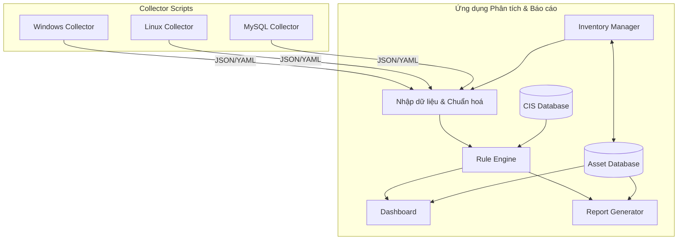

# Thiết kế công cụ tự động hoá Security Audit theo CIS Benchmark (Monolithic)

## Kiến trúc tổng thể



## Các thành phần chính

### 1. Collector Scripts (độc lập)
- **Scripts riêng biệt** chạy trên máy chủ đích:
  - Windows Collector (PowerShell)
  - Linux Collector (Bash/Python)
  - MySQL Collector (Python/SQL)
- **Chức năng**:
  - Chạy trực tiếp trên máy cần đánh giá
  - Thu thập thông tin cấu hình theo tiêu chí CIS
  - Xuất kết quả theo định dạng JSON/YAML chuẩn
  - Không yêu cầu cài đặt phức tạp
- **Xuất dữ liệu**: Tạo file JSON/YAML với cấu trúc chuẩn hóa

### 2. Ứng dụng Phân tích & Báo cáo (đơn khối)
- **Ứng dụng Desktop/CLI** chạy trên máy phân tích:
  - Giao diện đơn giản để nạp dữ liệu
  - Cơ sở dữ liệu nhúng (SQLite)
  - Phân tích theo tiêu chuẩn CIS
- **Các module chính**:
  - **Inventory Manager**: Quản lý máy chủ, thiết bị, DB theo dự án
  - **Nhập & Chuẩn hóa**: Xử lý dữ liệu thu thập
  - **CIS Database**: Lưu trữ quy tắc đánh giá
  - **Asset Database**: Lưu trữ thông tin máy chủ, thiết bị theo dự án
  - **Rule Engine**: Đánh giá tuân thủ
  - **Dashboard**: Hiển thị tổng quan
  - **Report Generator**: Tạo báo cáo chi tiết

## Quy trình làm việc

1. **Quản lý Inventory**:
   - Tạo dự án và nhóm các tài sản
   - Thêm máy chủ, thiết bị, DB vào inventory
   - Phân loại, gắn thẻ và quản lý metadata

2. **Thu thập dữ liệu**:
   - Chạy collector script trên máy cần đánh giá
   - Lưu kết quả vào file JSON/YAML
   - Liên kết kết quả với tài sản trong inventory

3. **Phân tích**:
   - Chép file dữ liệu về máy phân tích
   - Nạp file vào ứng dụng phân tích
   - Ứng dụng đánh giá theo tiêu chuẩn CIS

4. **Báo cáo**:
   - Xem dashboard tổng quan tuân thủ theo dự án/nhóm
   - Xuất báo cáo chi tiết (PDF/HTML)
   - Xem các khuyến nghị khắc phục
   - So sánh kết quả giữa các tài sản trong cùng dự án

5. **Khắc phục**:
   - Thực hiện các khuyến nghị
   - Chạy lại đánh giá để kiểm tra tiến độ
   - Theo dõi sự cải thiện theo thời gian

## Cách tiếp cận đơn giản hóa

### 1. Collector Scripts
- **Lightweight**: Scripts nhẹ, chỉ thực hiện thu thập dữ liệu
- **Độc lập**: Không phụ thuộc vào ứng dụng phân tích
- **Chuẩn hóa đầu ra**: Đảm bảo định dạng dữ liệu nhất quán

### 2. Ứng dụng Phân tích
- **Tất cả trong một**: Kết hợp chức năng chuẩn hóa, đánh giá và báo cáo
- **Giao diện đơn giản**: Dễ sử dụng, tập trung vào chức năng
- **Cơ sở dữ liệu nhúng**: Sử dụng SQLite thay vì CSDL phức tạp
- **Lịch sử đánh giá**: Lưu trữ và so sánh kết quả qua thời gian

## Lưu trữ dữ liệu

### 1. Schema dữ liệu thu thập
Giữ nguyên cấu trúc schema dữ liệu thu thập đã thiết kế trước đó để đảm bảo tính nhất quán:
```
{
  "system_info": {...},
  "collection_info": {...},
  "collected_data": {...}
}
```

### 2. Cơ sở dữ liệu CIS
- Cấu trúc lưu trữ dạng nhúng (SQLite):
  - Bảng Benchmarks
  - Bảng Profiles
  - Bảng Controls
  - Bảng Results

### 3. Cơ sở dữ liệu Inventory
- Cấu trúc lưu trữ trong SQLite:
  - Bảng Projects (quản lý dự án)
  - Bảng Assets (máy chủ, thiết bị, DB...)
  - Bảng AssetGroups (nhóm thiết bị)
  - Bảng Assessments (các lần đánh giá)
  - Bảng AssetTags (gắn thẻ cho tài sản)

### 4. Lưu trữ kết quả
- Kết quả đánh giá lưu dưới dạng SQLite và có thể xuất JSON
- Báo cáo xuất dạng HTML/PDF theo dự án hoặc nhóm tài sản

## Ưu điểm của thiết kế mới

1. **Đơn giản**: Dễ phát triển, triển khai và bảo trì
2. **Hiệu quả**: Tập trung vào chức năng cốt lõi, loại bỏ phức tạp không cần thiết
3. **Linh hoạt**: Scripts collector có thể chạy độc lập trên nhiều môi trường
4. **Không phụ thuộc mạng**: Không yêu cầu kết nối SSH, API, hoặc mạng phức tạp
5. **Thân thiện người dùng**: Quy trình rõ ràng, dễ hiểu và thực hiện

## Nhược điểm và giới hạn

1. **Ít tự động hóa**: Cần thao tác thủ công để chuyển dữ liệu giữa các máy
2. **Quản lý phân tán**: Không tập trung quản lý nhiều hệ thống
3. **Hạn chế mở rộng**: Khó áp dụng cho môi trường doanh nghiệp lớn với nhiều hệ thống

## Bước tiếp theo

1. Phát triển collector scripts cho các nền tảng ưu tiên
2. Xây dựng ứng dụng phân tích đơn giản
3. Tạo cơ sở dữ liệu CIS cho các benchmark phổ biến
4. Kiểm thử và tối ưu hóa quy trình làm việc