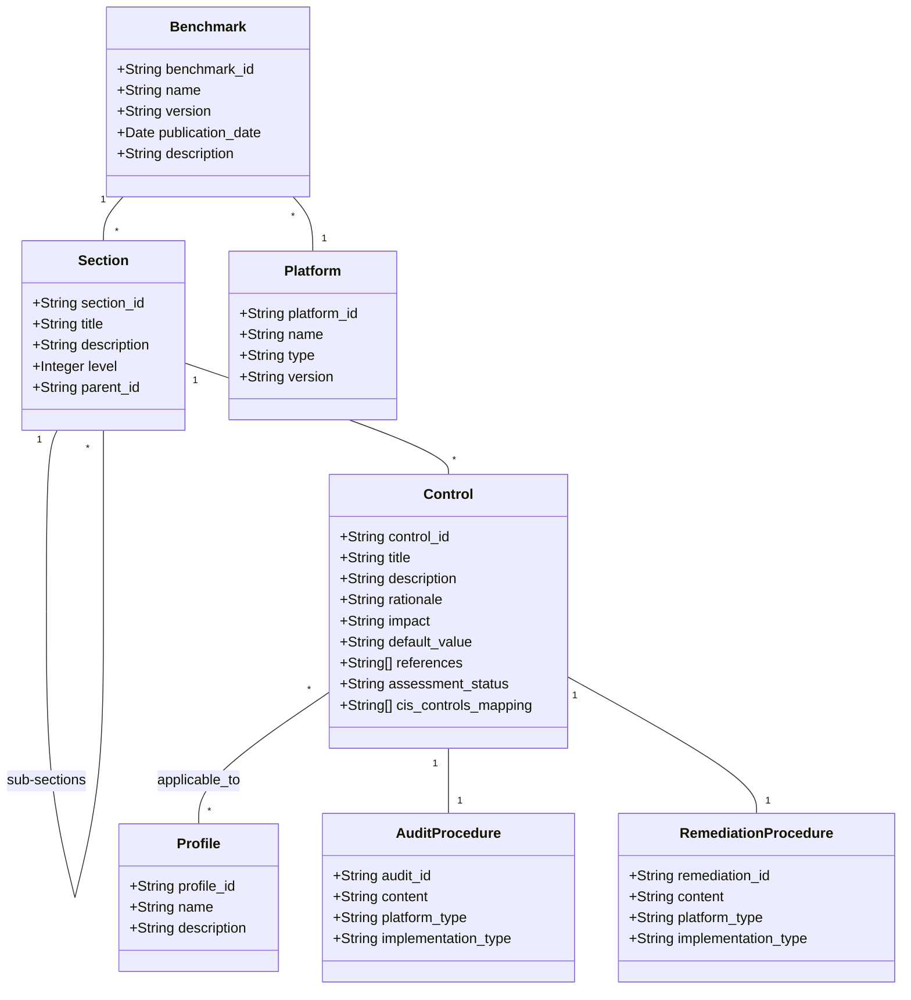

# Thiết kế cấu trúc dữ liệu CIS Benchmark

## Mục lục
1. [Giới thiệu](#giới-thiệu)
2. [Phân tích cấu trúc chung các CIS Benchmarks](#phân-tích-cấu-trúc-chung-các-cis-benchmarks)
   - [Cấu trúc Benchmark](#cấu-trúc-benchmark)
   - [Cấu trúc khuyến nghị (Control)](#cấu-trúc-khuyến-nghị-control)
   - [Điểm khác nhau giữa các Benchmark](#điểm-khác-nhau-giữa-các-benchmark)
3. [Mô hình dữ liệu chung](#mô-hình-dữ-liệu-chung)
   - [Sơ đồ quan hệ](#sơ-đồ-quan-hệ)
   - [Mô tả chi tiết các đối tượng](#mô-tả-chi-tiết-các-đối-tượng)
4. [Kết luận](#kết-luận)

## Giới thiệu

Tài liệu này mô tả thiết kế cấu trúc dữ liệu chung cho việc lưu trữ và xử lý các CIS Benchmark từ nhiều hệ thống khác nhau (Windows, Ubuntu Linux, MySQL). Mục tiêu là tạo một mô hình dữ liệu thống nhất có thể hỗ trợ đánh giá an ninh trên nhiều loại hệ thống khác nhau.

## Phân tích cấu trúc chung các CIS Benchmarks

### Cấu trúc Benchmark

| Thành phần | Mô tả | Windows | Ubuntu | MySQL |
|------------|-------|---------|--------|-------|
| Thông tin Benchmark | Thông tin định danh và phiên bản | ✓ | ✓ | ✓ |
| Profiles/Levels | Phân loại khuyến nghị theo mức độ | ✓ | ✓ | ✓ |
| Phân cấp nội dung | Cấu trúc phân cấp section > controls | ✓ | ✓ | ✓ |
| Khuyến nghị (Controls) | Các kiểm tra bảo mật cụ thể | ✓ | ✓ | ✓ |
| Phương pháp đánh giá | Automated/Manual | ✓ | ✓ | ✓ |

Tất cả các CIS Benchmark đều tuân theo cấu trúc cơ bản sau:
- **Benchmark**: Tài liệu tổng thể với thông tin định danh và phiên bản
- **Profiles**: Phân loại các khuyến nghị theo mức độ (Level 1, Level 2, STIG...)
- **Sections**: Các nhóm khuyến nghị theo chủ đề (ví dụ: Account Policies, Filesystem...)
- **Controls**: Các khuyến nghị bảo mật cụ thể

### Cấu trúc khuyến nghị (Control)

| Thành phần | Mô tả | Windows | Ubuntu | MySQL |
|------------|-------|---------|--------|-------|
| ID | Mã định danh (phân cấp dạng X.Y.Z) | ✓ | ✓ | ✓ |
| Title | Tiêu đề mô tả khuyến nghị | ✓ | ✓ | ✓ |
| Profile Applicability | Áp dụng cho mức độ/profile nào | ✓ | ✓ | ✓ |
| Description | Mô tả chi tiết | ✓ | ✓ | ✓ |
| Rationale | Lý do thực hiện | ✓ | ✓ | ✓ |
| Impact | Tác động khi áp dụng | ✓ | ✓ | ✓ |
| Audit Procedure | Hướng dẫn kiểm tra | ✓ | ✓ | ✓ |
| Remediation Procedure | Hướng dẫn khắc phục | ✓ | ✓ | ✓ |
| Default Value | Giá trị mặc định | ✓ | ✓ | ✓ |
| References | Tham chiếu thêm | ✓ | ✓ | ✓ |
| CIS Controls Mapping | Ánh xạ tới CIS Controls | ✓ | ✓ | ✓ |

Mỗi Control (khuyến nghị) đều có các thành phần sau:
- **ID và Title**: Định danh và tên của khuyến nghị
- **Profile Applicability**: Thông tin về mức độ áp dụng (Level 1, Level 2...)
- **Description**: Mô tả chi tiết về khuyến nghị
- **Rationale**: Lý do tại sao cần thực hiện khuyến nghị này
- **Impact**: Tác động có thể có khi áp dụng khuyến nghị
- **Audit/Remediation**: Hướng dẫn cách kiểm tra và khắc phục
- **Metadata**: Thông tin bổ sung như giá trị mặc định, tham khảo...

### Điểm khác nhau giữa các Benchmark

- **Phạm vi kiểm tra**: 
  - Windows: Tập trung vào Group Policy, Registry Settings
  - Ubuntu: Tập trung vào filesystem, kernel modules, service configs
  - MySQL: Tập trung vào database configs, permissions, logging

- **Phương pháp kiểm tra**: 
  - Windows: Group Policy, Registry checks
  - Ubuntu: Shell commands, file existence/content checks
  - MySQL: SQL queries, config file checks

- **Cấu trúc Profile**: 
  - Windows: Domain Controller/Member Server/STIG profiles
  - Ubuntu: Server/Workstation profiles
  - MySQL: MySQL RDBMS on Linux/MySQL RDBMS standalone

## Mô hình dữ liệu chung

### Sơ đồ quan hệ



### Mô tả chi tiết các đối tượng

#### Benchmark
Đại diện cho một CIS Benchmark cụ thể.

| Thuộc tính | Kiểu dữ liệu | Mô tả |
|------------|--------------|-------|
| benchmark_id | String | ID định danh duy nhất của benchmark |
| name | String | Tên đầy đủ của benchmark |
| version | String | Phiên bản benchmark |
| publication_date | Date | Ngày phát hành benchmark |
| description | String | Mô tả tổng quan về benchmark |
| platform_id | String | ID nền tảng mà benchmark áp dụng |

#### Platform
Đại diện cho nền tảng được đánh giá (OS, Database...).

| Thuộc tính | Kiểu dữ liệu | Mô tả |
|------------|--------------|-------|
| platform_id | String | ID định danh duy nhất của nền tảng |
| name | String | Tên nền tảng (Windows, Ubuntu, MySQL...) |
| type | String | Loại nền tảng (OS, Database, Network...) |
| version | String | Phiên bản nền tảng |

#### Profile
Đại diện cho một mức độ đánh giá trong benchmark.

| Thuộc tính | Kiểu dữ liệu | Mô tả |
|------------|--------------|-------|
| profile_id | String | ID định danh duy nhất của profile |
| name | String | Tên profile (Level 1 Server, STIG...) |
| description | String | Mô tả profile và mục đích sử dụng |

#### Section
Đại diện cho một phần của benchmark, có thể chứa nhiều section con.

| Thuộc tính | Kiểu dữ liệu | Mô tả |
|------------|--------------|-------|
| section_id | String | ID định danh duy nhất của section |
| title | String | Tiêu đề section |
| description | String | Mô tả section |
| level | Integer | Cấp độ phân cấp (1, 2, 3...) |
| parent_id | String | ID của section cha (nếu có) |

#### Control
Đại diện cho một khuyến nghị bảo mật cụ thể.

| Thuộc tính | Kiểu dữ liệu | Mô tả |
|------------|--------------|-------|
| control_id | String | ID định danh duy nhất (ví dụ: 1.1.1) |
| title | String | Tiêu đề khuyến nghị |
| description | String | Mô tả chi tiết |
| rationale | String | Giải thích lý do cần thực hiện |
| impact | String | Tác động khi áp dụng |
| default_value | String | Giá trị mặc định |
| references | String[] | Tham chiếu thêm |
| assessment_status | String | Automated/Manual |
| cis_controls_mapping | String[] | Ánh xạ tới CIS Controls |
| audit_id | String | ID thủ tục đánh giá |
| remediation_id | String | ID thủ tục khắc phục |

#### AuditProcedure
Đại diện cho thủ tục kiểm tra một control.

| Thuộc tính | Kiểu dữ liệu | Mô tả |
|------------|--------------|-------|
| audit_id | String | ID định danh duy nhất |
| content | String | Nội dung thủ tục kiểm tra |
| platform_type | String | Loại nền tảng áp dụng |
| implementation_type | String | Kiểu thực hiện (command/script/manual) |

#### RemediationProcedure
Đại diện cho thủ tục khắc phục một control.

| Thuộc tính | Kiểu dữ liệu | Mô tả |
|------------|--------------|-------|
| remediation_id | String | ID định danh duy nhất |
| content | String | Nội dung thủ tục khắc phục |
| platform_type | String | Loại nền tảng áp dụng |
| implementation_type | String | Kiểu thực hiện (command/script/manual) |

## Kết luận

Mô hình dữ liệu chung này cho phép:
1. Lưu trữ và xử lý thông tin từ nhiều loại CIS Benchmark khác nhau
2. Duy trì cấu trúc phân cấp và quan hệ giữa các thành phần
3. Hỗ trợ nhiều loại nền tảng (OS, Database, Network...)
4. Mở rộng dễ dàng cho các benchmark mới

Thiết kế này phù hợp với yêu cầu của công cụ tự động hóa Security Audit theo CIS Benchmark, cho phép chuẩn hóa và đánh giá data từ nhiều nguồn khác nhau.
```