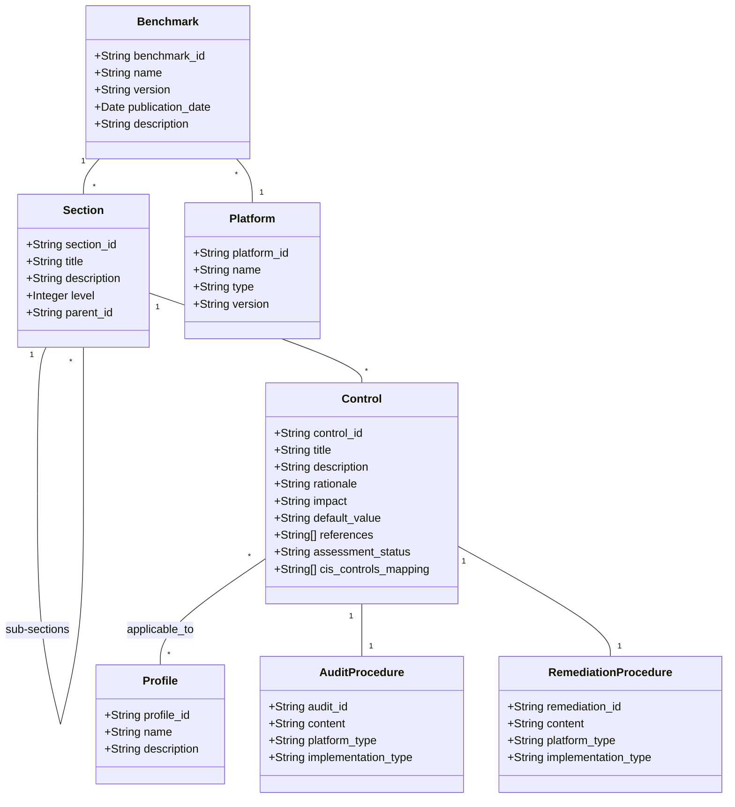

# Thiết kế cấu trúc dữ liệu CIS Benchmark

## Mục lục
1. [Giới thiệu](#giới-thiệu)
2. [Phân tích cấu trúc chung các CIS Benchmarks](#phân-tích-cấu-trúc-chung-các-cis-benchmarks)
   - [Cấu trúc Benchmark](#cấu-trúc-benchmark)
   - [Cấu trúc khuyến nghị (Control)](#cấu-trúc-khuyến-nghị-control)
   - [Điểm khác nhau giữa các Benchmark](#điểm-khác-nhau-giữa-các-benchmark)
3. [Mô hình dữ liệu chung](#mô-hình-dữ-liệu-chung)
   - [Sơ đồ quan hệ](#sơ-đồ-quan-hệ)
   - [Mô tả chi tiết các đối tượng](#mô-tả-chi-tiết-các-đối-tượng)
4. [Kết luận](#kết-luận)

## Giới thiệu

Tài liệu này mô tả thiết kế cấu trúc dữ liệu chung cho việc lưu trữ và xử lý các CIS Benchmark từ nhiều hệ thống khác nhau (Windows, Ubuntu Linux, MySQL). Mục tiêu là tạo một mô hình dữ liệu thống nhất có thể hỗ trợ đánh giá an ninh trên nhiều loại hệ thống khác nhau.

## Phân tích cấu trúc chung các CIS Benchmarks

### Cấu trúc Benchmark

| Thành phần | Mô tả | Windows | Ubuntu | MySQL |
|------------|-------|---------|--------|-------|
| Thông tin Benchmark | Thông tin định danh và phiên bản | ✓ | ✓ | ✓ |
| Profiles/Levels | Phân loại khuyến nghị theo mức độ | ✓ | ✓ | ✓ |
| Phân cấp nội dung | Cấu trúc phân cấp section > controls | ✓ | ✓ | ✓ |
| Khuyến nghị (Controls) | Các kiểm tra bảo mật cụ thể | ✓ | ✓ | ✓ |
| Phương pháp đánh giá | Automated/Manual | ✓ | ✓ | ✓ |

Tất cả các CIS Benchmark đều tuân theo cấu trúc cơ bản sau:
- **Benchmark**: Tài liệu tổng thể với thông tin định danh và phiên bản
- **Profiles**: Phân loại các khuyến nghị theo mức độ (Level 1, Level 2, STIG...)
- **Sections**: Các nhóm khuyến nghị theo chủ đề (ví dụ: Account Policies, Filesystem...)
- **Controls**: Các khuyến nghị bảo mật cụ thể

### Cấu trúc khuyến nghị (Control)

| Thành phần | Mô tả | Windows | Ubuntu | MySQL |
|------------|-------|---------|--------|-------|
| ID | Mã định danh (phân cấp dạng X.Y.Z) | ✓ | ✓ | ✓ |
| Title | Tiêu đề mô tả khuyến nghị | ✓ | ✓ | ✓ |
| Profile Applicability | Áp dụng cho mức độ/profile nào | ✓ | ✓ | ✓ |
| Description | Mô tả chi tiết | ✓ | ✓ | ✓ |
| Rationale | Lý do thực hiện | ✓ | ✓ | ✓ |
| Impact | Tác động khi áp dụng | ✓ | ✓ | ✓ |
| Audit Procedure | Hướng dẫn kiểm tra | ✓ | ✓ | ✓ |
| Remediation Procedure | Hướng dẫn khắc phục | ✓ | ✓ | ✓ |
| Default Value | Giá trị mặc định | ✓ | ✓ | ✓ |
| References | Tham chiếu thêm | ✓ | ✓ | ✓ |
| CIS Controls Mapping | Ánh xạ tới CIS Controls | ✓ | ✓ | ✓ |

Mỗi Control (khuyến nghị) đều có các thành phần sau:
- **ID và Title**: Định danh và tên của khuyến nghị
- **Profile Applicability**: Thông tin về mức độ áp dụng (Level 1, Level 2...)
- **Description**: Mô tả chi tiết về khuyến nghị
- **Rationale**: Lý do tại sao cần thực hiện khuyến nghị này
- **Impact**: Tác động có thể có khi áp dụng khuyến nghị
- **Audit/Remediation**: Hướng dẫn cách kiểm tra và khắc phục
- **Metadata**: Thông tin bổ sung như giá trị mặc định, tham khảo...

### Điểm khác nhau giữa các Benchmark

- **Phạm vi kiểm tra**: 
  - Windows: Tập trung vào Group Policy, Registry Settings
  - Ubuntu: Tập trung vào filesystem, kernel modules, service configs
  - MySQL: Tập trung vào database configs, permissions, logging

- **Phương pháp kiểm tra**: 
  - Windows: Group Policy, Registry checks
  - Ubuntu: Shell commands, file existence/content checks
  - MySQL: SQL queries, config file checks

- **Cấu trúc Profile**: 
  - Windows: Domain Controller/Member Server/STIG profiles
  - Ubuntu: Server/Workstation profiles
  - MySQL: MySQL RDBMS on Linux/MySQL RDBMS standalone

## Mô hình dữ liệu chung

### Sơ đồ quan hệ



### Mô tả chi tiết các đối tượng

#### Benchmark
Đại diện cho một CIS Benchmark cụ thể.

| Thuộc tính | Kiểu dữ liệu | Mô tả |
|------------|--------------|-------|
| benchmark_id | String | ID định danh duy nhất của benchmark |
| name | String | Tên đầy đủ của benchmark |
| version | String | Phiên bản benchmark |
| publication_date | Date | Ngày phát hành benchmark |
| description | String | Mô tả tổng quan về benchmark |
| platform_id | String | ID nền tảng mà benchmark áp dụng |

#### Platform
Đại diện cho nền tảng được đánh giá (OS, Database...).

| Thuộc tính | Kiểu dữ liệu | Mô tả |
|------------|--------------|-------|
| platform_id | String | ID định danh duy nhất của nền tảng |
| name | String | Tên nền tảng (Windows, Ubuntu, MySQL...) |
| type | String | Loại nền tảng (OS, Database, Network...) |
| version | String | Phiên bản nền tảng |

#### Profile
Đại diện cho một mức độ đánh giá trong benchmark.

| Thuộc tính | Kiểu dữ liệu | Mô tả |
|------------|--------------|-------|
| profile_id | String | ID định danh duy nhất của profile |
| name | String | Tên profile (Level 1 Server, STIG...) |
| description | String | Mô tả profile và mục đích sử dụng |

#### Section
Đại diện cho một phần của benchmark, có thể chứa nhiều section con.

| Thuộc tính | Kiểu dữ liệu | Mô tả |
|------------|--------------|-------|
| section_id | String | ID định danh duy nhất của section |
| title | String | Tiêu đề section |
| description | String | Mô tả section |
| level | Integer | Cấp độ phân cấp (1, 2, 3...) |
| parent_id | String | ID của section cha (nếu có) |

#### Control
Đại diện cho một khuyến nghị bảo mật cụ thể.

| Thuộc tính | Kiểu dữ liệu | Mô tả |
|------------|--------------|-------|
| control_id | String | ID định danh duy nhất (ví dụ: 1.1.1) |
| title | String | Tiêu đề khuyến nghị |
| description | String | Mô tả chi tiết |
| rationale | String | Giải thích lý do cần thực hiện |
| impact | String | Tác động khi áp dụng |
| default_value | String | Giá trị mặc định |
| references | String[] | Tham chiếu thêm |
| assessment_status | String | Automated/Manual |
| cis_controls_mapping | String[] | Ánh xạ tới CIS Controls |
| audit_id | String | ID thủ tục đánh giá |
| remediation_id | String | ID thủ tục khắc phục |

#### AuditProcedure
Đại diện cho thủ tục kiểm tra một control.

| Thuộc tính | Kiểu dữ liệu | Mô tả |
|------------|--------------|-------|
| audit_id | String | ID định danh duy nhất |
| content | String | Nội dung thủ tục kiểm tra |
| platform_type | String | Loại nền tảng áp dụng |
| implementation_type | String | Kiểu thực hiện (command/script/manual) |

#### RemediationProcedure
Đại diện cho thủ tục khắc phục một control.

| Thuộc tính | Kiểu dữ liệu | Mô tả |
|------------|--------------|-------|
| remediation_id | String | ID định danh duy nhất |
| content | String | Nội dung thủ tục khắc phục |
| platform_type | String | Loại nền tảng áp dụng |
| implementation_type | String | Kiểu thực hiện (command/script/manual) |

## Kết luận

Mô hình dữ liệu chung này cho phép:
1. Lưu trữ và xử lý thông tin từ nhiều loại CIS Benchmark khác nhau
2. Duy trì cấu trúc phân cấp và quan hệ giữa các thành phần
3. Hỗ trợ nhiều loại nền tảng (OS, Database, Network...)
4. Mở rộng dễ dàng cho các benchmark mới

Thiết kế này phù hợp với yêu cầu của công cụ tự động hóa Security Audit theo CIS Benchmark, cho phép chuẩn hóa và đánh giá data từ nhiều nguồn khác nhau.

# Mô tả quan hệ cho mô hình dữ liệu CIS

Tôi sẽ bổ sung mô tả chi tiết về quan hệ giữa các bảng trong mô hình dữ liệu CIS Benchmark. Đây là nội dung cần thêm vào file `cis_data_structure.md`:

## Mô tả quan hệ giữa các bảng

### 1. Quan hệ Benchmark - Platform

| Từ | Đến | Loại quan hệ | Mô tả |
|-----|-----|--------------|-------|
| Benchmark | Platform | Nhiều-một (N:1) | Mỗi benchmark thuộc về một platform cụ thể (Windows, Linux, MySQL...). Một platform có thể có nhiều benchmark khác nhau (cho các phiên bản khác nhau). |

**Ràng buộc**:
- Trường `platform_id` trong bảng `Benchmark` là khóa ngoại tới bảng `Platform`
- Mỗi benchmark phải thuộc về một platform xác định

### 2. Quan hệ Benchmark - Section

| Từ | Đến | Loại quan hệ | Mô tả |
|-----|-----|--------------|-------|
| Benchmark | Section | Một-nhiều (1:N) | Mỗi benchmark chứa nhiều section (các phần khác nhau của tài liệu). Mỗi section thuộc về một benchmark duy nhất. |

**Ràng buộc**:
- Trường `benchmark_id` trong bảng `Section` là khóa ngoại tới bảng `Benchmark`
- Mỗi section phải thuộc về một benchmark xác định

### 3. Quan hệ Section - Section (Phân cấp)

| Từ | Đến | Loại quan hệ | Mô tả |
|-----|-----|--------------|-------|
| Section | Section | Một-nhiều (1:N) self-referencing | Mỗi section có thể chứa nhiều section con. Mỗi section con thuộc về một section cha duy nhất. |

**Ràng buộc**:
- Trường `parent_id` trong bảng `Section` là khóa ngoại tự tham chiếu (self-referencing) tới chính bảng `Section`
- Section gốc có `parent_id` là NULL
- Không được tạo thành chu trình trong quan hệ cha-con

### 4. Quan hệ Section - Control

| Từ | Đến | Loại quan hệ | Mô tả |
|-----|-----|--------------|-------|
| Section | Control | Một-nhiều (1:N) | Mỗi section chứa nhiều control (khuyến nghị bảo mật). Mỗi control thuộc về một section duy nhất. |

**Ràng buộc**:
- Trường `section_id` trong bảng `Control` là khóa ngoại tới bảng `Section`
- Mỗi control phải thuộc về một section xác định

### 5. Quan hệ Control - Profile (Control_Profile)

| Từ | Đến | Loại quan hệ | Mô tả |
|-----|-----|--------------|-------|
| Control | Profile | Nhiều-nhiều (M:N) | Một control có thể áp dụng cho nhiều profile khác nhau (Level 1, Level 2, STIG...). Một profile bao gồm nhiều control khác nhau. |

**Ràng buộc**:
- Bảng trung gian `Control_Profile` với hai khóa ngoại là `control_id` và `profile_id`
- Mỗi cặp (control_id, profile_id) phải là duy nhất trong bảng `Control_Profile`

### 6. Quan hệ Control - AuditProcedure

| Từ | Đến | Loại quan hệ | Mô tả |
|-----|-----|--------------|-------|
| Control | AuditProcedure | Một-một (1:1) | Mỗi control có một thủ tục đánh giá (audit procedure) duy nhất. Mỗi thủ tục đánh giá thuộc về một control duy nhất. |

**Ràng buộc**:
- Trường `audit_id` trong bảng `Control` là khóa ngoại tới bảng `AuditProcedure`
- Mỗi control phải có một audit procedure xác định

### 7. Quan hệ Control - RemediationProcedure

| Từ | Đến | Loại quan hệ | Mô tả |
|-----|-----|--------------|-------|
| Control | RemediationProcedure | Một-một (1:1) | Mỗi control có một thủ tục khắc phục (remediation procedure) duy nhất. Mỗi thủ tục khắc phục thuộc về một control duy nhất. |

**Ràng buộc**:
- Trường `remediation_id` trong bảng `Control` là khóa ngoại tới bảng `RemediationProcedure`
- Mỗi control phải có một remediation procedure xác định

### 8. Quan hệ Benchmark - Profile

| Từ | Đến | Loại quan hệ | Mô tả |
|-----|-----|--------------|-------|
| Benchmark | Profile | Một-nhiều (1:N) | Mỗi benchmark định nghĩa nhiều profile khác nhau (Level 1, Level 2, STIG...). Mỗi profile thuộc về một benchmark duy nhất. |

**Ràng buộc**:
- Trường `benchmark_id` trong bảng `Profile` là khóa ngoại tới bảng `Benchmark`
- Mỗi profile phải thuộc về một benchmark xác định

## Hướng dẫn thực hiện quan hệ

### Triển khai trong SQL

Dưới đây là ví dụ về cách triển khai các ràng buộc khóa ngoại trong SQL:

```sql
-- Tạo bảng Platform
CREATE TABLE Platform (
    platform_id VARCHAR(50) PRIMARY KEY,
    name VARCHAR(100) NOT NULL,
    type VARCHAR(50) NOT NULL,
    version VARCHAR(50) NOT NULL
);

-- Tạo bảng Benchmark với khóa ngoại tới Platform
CREATE TABLE Benchmark (
    benchmark_id VARCHAR(50) PRIMARY KEY,
    name VARCHAR(200) NOT NULL,
    version VARCHAR(50) NOT NULL,
    publication_date DATE NOT NULL,
    description TEXT,
    platform_id VARCHAR(50) NOT NULL,
    FOREIGN KEY (platform_id) REFERENCES Platform(platform_id)
);

-- Tạo bảng Profile với khóa ngoại tới Benchmark
CREATE TABLE Profile (
    profile_id VARCHAR(50) PRIMARY KEY,
    benchmark_id VARCHAR(50) NOT NULL,
    name VARCHAR(100) NOT NULL,
    description TEXT,
    FOREIGN KEY (benchmark_id) REFERENCES Benchmark(benchmark_id)
);

-- Tạo bảng Section với khóa ngoại tới Benchmark và self-reference
CREATE TABLE Section (
    section_id VARCHAR(50) PRIMARY KEY,
    benchmark_id VARCHAR(50) NOT NULL,
    title VARCHAR(200) NOT NULL,
    description TEXT,
    level INT NOT NULL,
    parent_id VARCHAR(50),
    FOREIGN KEY (benchmark_id) REFERENCES Benchmark(benchmark_id),
    FOREIGN KEY (parent_id) REFERENCES Section(section_id)
);

-- Tạo bảng AuditProcedure
CREATE TABLE AuditProcedure (
    audit_id VARCHAR(50) PRIMARY KEY,
    content TEXT NOT NULL,
    platform_type VARCHAR(50) NOT NULL,
    implementation_type VARCHAR(50) NOT NULL
);

-- Tạo bảng RemediationProcedure
CREATE TABLE RemediationProcedure (
    remediation_id VARCHAR(50) PRIMARY KEY,
    content TEXT NOT NULL,
    platform_type VARCHAR(50) NOT NULL,
    implementation_type VARCHAR(50) NOT NULL
);

-- Tạo bảng Control với khóa ngoại tới Section, AuditProcedure và RemediationProcedure
CREATE TABLE Control (
    control_id VARCHAR(50) PRIMARY KEY,
    section_id VARCHAR(50) NOT NULL,
    title VARCHAR(200) NOT NULL,
    description TEXT,
    rationale TEXT,
    impact TEXT,
    default_value VARCHAR(200),
    assessment_status VARCHAR(50) NOT NULL,
    audit_id VARCHAR(50) NOT NULL,
    remediation_id VARCHAR(50) NOT NULL,
    FOREIGN KEY (section_id) REFERENCES Section(section_id),
    FOREIGN KEY (audit_id) REFERENCES AuditProcedure(audit_id),
    FOREIGN KEY (remediation_id) REFERENCES RemediationProcedure(remediation_id)
);

-- Tạo bảng trung gian Control_Profile cho quan hệ nhiều-nhiều
CREATE TABLE Control_Profile (
    control_id VARCHAR(50) NOT NULL,
    profile_id VARCHAR(50) NOT NULL,
    PRIMARY KEY (control_id, profile_id),
    FOREIGN KEY (control_id) REFERENCES Control(control_id),
    FOREIGN KEY (profile_id) REFERENCES Profile(profile_id)
);
```

### Triển khai trong mã nguồn

Khi triển khai các quan hệ này trong mã nguồn, cần đảm bảo tính toàn vẹn dữ liệu:

```python
# Ví dụ về việc thêm một control vào section và profile
def add_control_to_section_and_profiles(control_data, section_id, profile_ids):
    # Kiểm tra section có tồn tại không
    if not section_exists(section_id):
        raise ValueError(f"Section {section_id} không tồn tại")
    
    # Kiểm tra các profile có tồn tại không
    for profile_id in profile_ids:
        if not profile_exists(profile_id):
            raise ValueError(f"Profile {profile_id} không tồn tại")
    
    # Tạo thủ tục audit và remediation
    audit_id = create_audit_procedure(control_data['audit_procedure'])
    remediation_id = create_remediation_procedure(control_data['remediation_procedure'])
    
    # Tạo control
    control_id = create_control(
        title=control_data['title'],
        description=control_data['description'],
        section_id=section_id,
        audit_id=audit_id,
        remediation_id=remediation_id
    )
    
    # Liên kết control với các profile
    for profile_id in profile_ids:
        link_control_to_profile(control_id, profile_id)
    
    return control_id
```

## Quản lý toàn vẹn tham chiếu

### Xử lý khi xóa

Cần xử lý cẩn thận khi xóa các bản ghi để tránh mất toàn vẹn tham chiếu:

1. **Cascade Delete**: Khi xóa một benchmark, tất cả section, control, profile và các liên kết liên quan sẽ bị xóa.
2. **Restrict Delete**: Không cho phép xóa một section nếu nó đang chứa các control.
3. **Nullify Reference**: Khi xóa một section cha, các section con có thể được đặt lại tham chiếu cha thành NULL.

Ví dụ SQL cho các ràng buộc này:

```sql
-- Cascade Delete khi xóa Benchmark
FOREIGN KEY (benchmark_id) REFERENCES Benchmark(benchmark_id) ON DELETE CASCADE

-- Restrict Delete khi xóa Section
FOREIGN KEY (section_id) REFERENCES Section(section_id) ON DELETE RESTRICT

-- Nullify Reference khi xóa Section cha
FOREIGN KEY (parent_id) REFERENCES Section(section_id) ON DELETE SET NULL
```

## Tạo dữ liệu mẫu

Khi tạo dữ liệu mẫu, cần tuân thủ đúng thứ tự để đảm bảo toàn vẹn tham chiếu:

1. Tạo Platform
2. Tạo Benchmark
3. Tạo Profile
4. Tạo Section gốc
5. Tạo Section con
6. Tạo AuditProcedure và RemediationProcedure
7. Tạo Control
8. Tạo liên kết Control_Profile