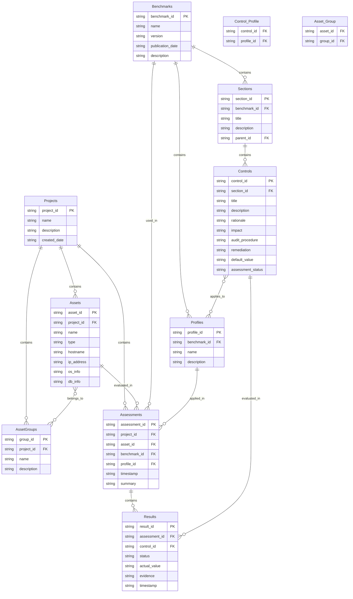

# Thiết kế cấu trúc dữ liệu CIS Benchmark

## Mục lục
1. [Giới thiệu](#giới-thiệu)
2. [Phân tích cấu trúc chung các CIS Benchmarks](#phân-tích-cấu-trúc-chung-các-cis-benchmarks)
   - [Cấu trúc Benchmark](#cấu-trúc-benchmark)
   - [Cấu trúc khuyến nghị (Control)](#cấu-trúc-khuyến-nghị-control)
   - [Điểm khác nhau giữa các Benchmark](#điểm-khác-nhau-giữa-các-benchmark)
3. [Mô hình dữ liệu SQLite](#mô-hình-dữ-liệu-sqlite)
   - [Sơ đồ cấu trúc CSDL](#sơ-đồ-cấu-trúc-csdl)
   - [Mô tả chi tiết các bảng](#mô-tả-chi-tiết-các-bảng)
4. [Cấu trúc dữ liệu Inventory](#cấu-trúc-dữ-liệu-inventory)
   - [Mô hình quản lý tài sản](#mô-hình-quản-lý-tài-sản)
   - [Phân nhóm và phân loại](#phân-nhóm-và-phân-loại)
5. [Lưu trữ kết quả đánh giá](#lưu-trữ-kết-quả-đánh-giá)
   - [Cấu trúc lưu trữ kết quả](#cấu-trúc-lưu-trữ-kết-quả)
   - [Theo dõi lịch sử](#theo-dõi-lịch-sử)
6. [Kết luận](#kết-luận)

## Giới thiệu

Tài liệu này mô tả thiết kế cấu trúc dữ liệu cho công cụ tự động hoá Security Audit theo CIS Benchmark với kiến trúc monolithic. Mục tiêu là tạo một mô hình dữ liệu đơn giản, hiệu quả và dễ triển khai, cho phép lưu trữ và quản lý thông tin từ các CIS Benchmark khác nhau cùng với kết quả đánh giá.

Thiết kế này tập trung vào việc sử dụng SQLite làm cơ sở dữ liệu nhúng, loại bỏ sự phức tạp không cần thiết của các cơ sở dữ liệu phân tán, đồng thời vẫn đảm bảo khả năng mở rộng và linh hoạt để hỗ trợ nhiều loại benchmark khác nhau.

## Phân tích cấu trúc chung các CIS Benchmarks

### Cấu trúc Benchmark

Sau khi phân tích các CIS Benchmark cho Windows, Ubuntu Linux và MySQL, chúng tôi nhận thấy một cấu trúc chung như sau:

| Thành phần | Mô tả | Windows | Ubuntu | MySQL |
|------------|-------|---------|--------|-------|
| Thông tin Benchmark | Thông tin định danh và phiên bản | ✓ | ✓ | ✓ |
| Profiles/Levels | Phân loại khuyến nghị theo mức độ | ✓ | ✓ | ✓ |
| Phân cấp nội dung | Cấu trúc phân cấp section > controls | ✓ | ✓ | ✓ |
| Khuyến nghị (Controls) | Các kiểm tra bảo mật cụ thể | ✓ | ✓ | ✓ |
| Phương pháp đánh giá | Automated/Manual | ✓ | ✓ | ✓ |

Tất cả các CIS Benchmark đều tuân theo cấu trúc cơ bản sau:
- **Benchmark**: Tài liệu tổng thể với thông tin định danh và phiên bản
- **Profiles**: Phân loại các khuyến nghị theo mức độ (Level 1, Level 2, STIG...)
- **Sections**: Các nhóm khuyến nghị theo chủ đề (ví dụ: Account Policies, Filesystem...)
- **Controls**: Các khuyến nghị bảo mật cụ thể

### Cấu trúc khuyến nghị (Control)

Mỗi Control (khuyến nghị) trong CIS Benchmark đều bao gồm các thành phần sau:

| Thành phần | Mô tả | Windows | Ubuntu | MySQL |
|------------|-------|---------|--------|-------|
| ID | Mã định danh (phân cấp dạng X.Y.Z) | ✓ | ✓ | ✓ |
| Title | Tiêu đề mô tả khuyến nghị | ✓ | ✓ | ✓ |
| Profile Applicability | Áp dụng cho mức độ/profile nào | ✓ | ✓ | ✓ |
| Description | Mô tả chi tiết | ✓ | ✓ | ✓ |
| Rationale | Lý do thực hiện | ✓ | ✓ | ✓ |
| Impact | Tác động khi áp dụng | ✓ | ✓ | ✓ |
| Audit Procedure | Hướng dẫn kiểm tra | ✓ | ✓ | ✓ |
| Remediation Procedure | Hướng dẫn khắc phục | ✓ | ✓ | ✓ |
| Default Value | Giá trị mặc định | ✓ | ✓ | ✓ |
| References | Tham chiếu thêm | ✓ | ✓ | ✓ |
| CIS Controls Mapping | Ánh xạ tới CIS Controls | ✓ | ✓ | ✓ |

### Điểm khác nhau giữa các Benchmark

Mặc dù có cấu trúc chung, mỗi loại Benchmark có những đặc thù riêng:

- **Phạm vi kiểm tra**: 
  - Windows: Tập trung vào Group Policy, Registry Settings
  - Ubuntu: Tập trung vào filesystem, kernel modules, service configs
  - MySQL: Tập trung vào database configs, permissions, logging

- **Phương pháp kiểm tra**: 
  - Windows: Group Policy, Registry checks
  - Ubuntu: Shell commands, file existence/content checks
  - MySQL: SQL queries, config file checks

- **Cấu trúc Profile**: 
  - Windows: Domain Controller/Member Server/STIG profiles
  - Ubuntu: Server/Workstation profiles
  - MySQL: MySQL RDBMS on Linux/MySQL RDBMS standalone

## Mô hình dữ liệu SQLite

### Sơ đồ cấu trúc CSDL

Mô hình dữ liệu cho SQLite được thiết kế đơn giản, gồm các bảng chính sau:

### Mô tả chi tiết các bảng

#### Bảng Benchmarks
Lưu trữ thông tin về CIS Benchmarks.

| Trường | Kiểu dữ liệu | Mô tả |
|--------|--------------|-------|
| benchmark_id | TEXT | ID định danh duy nhất của benchmark |
| name | TEXT | Tên đầy đủ của benchmark |
| version | TEXT | Phiên bản benchmark |
| publication_date | TEXT | Ngày phát hành benchmark |
| description | TEXT | Mô tả tổng quan |

#### Bảng Profiles
Lưu trữ thông tin về các profile trong benchmark.

| Trường | Kiểu dữ liệu | Mô tả |
|--------|--------------|-------|
| profile_id | TEXT | ID định danh duy nhất của profile |
| benchmark_id | TEXT | ID benchmark chứa profile này |
| name | TEXT | Tên profile (Level 1, Level 2, STIG...) |
| description | TEXT | Mô tả profile |

#### Bảng Sections
Lưu trữ thông tin về các section (phần) trong benchmark.

| Trường | Kiểu dữ liệu | Mô tả |
|--------|--------------|-------|
| section_id | TEXT | ID định danh duy nhất của section |
| benchmark_id | TEXT | ID benchmark chứa section này |
| title | TEXT | Tiêu đề section |
| description | TEXT | Mô tả section |
| parent_id | TEXT | ID của section cha (nếu có) |

#### Bảng Controls
Lưu trữ thông tin về các control (khuyến nghị) trong benchmark.

| Trường | Kiểu dữ liệu | Mô tả |
|--------|--------------|-------|
| control_id | TEXT | ID định danh duy nhất của control |
| section_id | TEXT | ID section chứa control này |
| title | TEXT | Tiêu đề control |
| description | TEXT | Mô tả control |
| rationale | TEXT | Lý do cần áp dụng |
| impact | TEXT | Tác động khi áp dụng |
| audit_procedure | TEXT | Hướng dẫn kiểm tra |
| remediation | TEXT | Hướng dẫn khắc phục |
| default_value | TEXT | Giá trị mặc định |
| assessment_status | TEXT | Automated/Manual |

#### Bảng Control_Profile
Bảng quan hệ nhiều-nhiều giữa Control và Profile.

| Trường | Kiểu dữ liệu | Mô tả |
|--------|--------------|-------|
| control_id | TEXT | ID của control |
| profile_id | TEXT | ID của profile |

#### Bảng Projects
Lưu trữ thông tin về các dự án đánh giá.

| Trường | Kiểu dữ liệu | Mô tả |
|--------|--------------|-------|
| project_id | TEXT | ID định danh duy nhất của dự án |
| name | TEXT | Tên dự án |
| description | TEXT | Mô tả dự án |
| created_date | TEXT | Ngày tạo dự án |

#### Bảng Assets
Lưu trữ thông tin về các tài sản (máy chủ, DB...) được đánh giá.

| Trường | Kiểu dữ liệu | Mô tả |
|--------|--------------|-------|
| asset_id | TEXT | ID định danh duy nhất của tài sản |
| project_id | TEXT | ID dự án chứa tài sản này |
| name | TEXT | Tên tài sản |
| type | TEXT | Loại tài sản (os, database...) |
| hostname | TEXT | Tên máy chủ |
| ip_address | TEXT | Địa chỉ IP |
| os_info | TEXT | Thông tin OS (JSON) |
| db_info | TEXT | Thông tin DB (JSON) |

#### Bảng AssetGroups
Lưu trữ thông tin về các nhóm tài sản.

| Trường | Kiểu dữ liệu | Mô tả |
|--------|--------------|-------|
| group_id | TEXT | ID định danh duy nhất của nhóm |
| project_id | TEXT | ID dự án chứa nhóm này |
| name | TEXT | Tên nhóm |
| description | TEXT | Mô tả nhóm |

#### Bảng Asset_Group
Bảng quan hệ nhiều-nhiều giữa Asset và AssetGroup.

| Trường | Kiểu dữ liệu | Mô tả |
|--------|--------------|-------|
| asset_id | TEXT | ID của tài sản |
| group_id | TEXT | ID của nhóm |

#### Bảng Assessments
Lưu trữ thông tin về các lần đánh giá.

| Trường | Kiểu dữ liệu | Mô tả |
|--------|--------------|-------|
| assessment_id | TEXT | ID định danh duy nhất của đánh giá |
| project_id | TEXT | ID dự án |
| asset_id | TEXT | ID tài sản được đánh giá |
| benchmark_id | TEXT | ID benchmark được sử dụng |
| profile_id | TEXT | ID profile được áp dụng |
| timestamp | TEXT | Thời điểm đánh giá |
| summary | TEXT | Tóm tắt kết quả (JSON) |

#### Bảng Results
Lưu trữ kết quả đánh giá chi tiết cho từng control.

| Trường | Kiểu dữ liệu | Mô tả |
|--------|--------------|-------|
| result_id | TEXT | ID định danh duy nhất của kết quả |
| assessment_id | TEXT | ID của đánh giá |
| control_id | TEXT | ID của control được đánh giá |
| status | TEXT | Trạng thái (pass/fail/unknown/not_applicable) |
| actual_value | TEXT | Giá trị thực tế |
| evidence | TEXT | Bằng chứng |
| timestamp | TEXT | Thời điểm đánh giá control |

## Cấu trúc dữ liệu Inventory

### Mô hình quản lý tài sản

Mô hình quản lý tài sản được thiết kế để hỗ trợ việc tổ chức và phân loại các tài sản theo dự án. Mỗi dự án có thể chứa nhiều tài sản khác nhau (máy chủ, cơ sở dữ liệu...), và mỗi tài sản có thể được phân vào nhiều nhóm khác nhau.

Các tính năng chính của mô hình quản lý tài sản:
1. **Tổ chức theo dự án**: Mỗi tài sản thuộc về một dự án cụ thể
2. **Phân loại tài sản**: Tài sản được phân loại theo loại (OS, Database...)
3. **Nhóm tài sản**: Tài sản có thể được nhóm lại để quản lý và đánh giá theo nhóm
4. **Lưu trữ metadata**: Thông tin chi tiết về tài sản được lưu trữ dưới dạng JSON

### Phân nhóm và phân loại

Tài sản có thể được phân nhóm và phân loại theo nhiều cách khác nhau:

1. **Phân loại theo loại hệ thống**:
   - OS (Windows, Linux...)
   - Database (MySQL, PostgreSQL...)
   - Network Devices
   - Cloud Services

2. **Phân nhóm theo mục đích**:
   - Production
   - Development
   - Testing
   - Staging

3. **Phân nhóm theo vị trí**:
   - Datacenter A
   - Datacenter B
   - Cloud
   - On-premise

4. **Phân nhóm theo mức độ quan trọng**:
   - Critical
   - High
   - Medium
   - Low

5. **Phân nhóm tùy chỉnh**:
   - Người dùng có thể tạo các nhóm tùy chỉnh theo nhu cầu

## Lưu trữ kết quả đánh giá

### Cấu trúc lưu trữ kết quả

Kết quả đánh giá được lưu trữ trong hai bảng chính:
- **Assessments**: Thông tin tổng quan về đánh giá
- **Results**: Kết quả chi tiết cho từng control

Mỗi lần đánh giá được lưu trữ với các thông tin:
- Tài sản được đánh giá
- Benchmark và profile được sử dụng
- Thời gian đánh giá
- Tóm tắt kết quả (số lượng pass/fail/unknown/not_applicable)
- Điểm tuân thủ tổng thể

Kết quả chi tiết cho từng control bao gồm:
- Trạng thái đánh giá (pass/fail/unknown/not_applicable)
- Giá trị thực tế trên hệ thống
- Bằng chứng từ quá trình đánh giá
- Thời gian đánh giá control

### Theo dõi lịch sử

Mô hình dữ liệu này cho phép theo dõi lịch sử đánh giá theo thời gian:
- Mỗi lần đánh giá được lưu trữ như một bản ghi riêng biệt
- Có thể so sánh kết quả giữa các lần đánh giá khác nhau
- Theo dõi tiến độ cải thiện tuân thủ theo thời gian
- Xác định các xu hướng và vấn đề tồn tại lâu dài

## Kết luận

Mô hình dữ liệu SQLite được thiết kế trong tài liệu này cung cấp một phương pháp đơn giản và hiệu quả để lưu trữ và xử lý các CIS Benchmark cùng với kết quả đánh giá. Thiết kế này có những ưu điểm sau:

1. **Đơn giản**: Sử dụng SQLite làm cơ sở dữ liệu nhúng, dễ dàng triển khai và sử dụng
2. **Linh hoạt**: Hỗ trợ nhiều loại benchmark khác nhau (Windows, Linux, MySQL...)
3. **Scalable**: Mô hình quản lý tài sản và dự án cho phép mở rộng dễ dàng
4. **Lịch sử**: Lưu trữ và so sánh kết quả đánh giá theo thời gian
5. **Tích hợp**: Dễ dàng tích hợp với các thành phần khác trong hệ thống

Thiết kế này phù hợp với yêu cầu của công cụ tự động hóa Security Audit theo CIS Benchmark theo kiến trúc monolithic, cho phép phát triển nhanh chóng và hiệu quả.