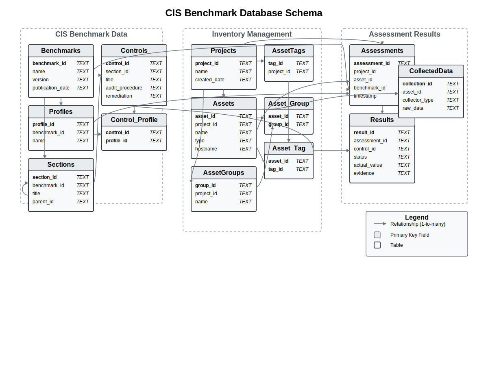

# Thiết kế Schema cho Công cụ Đánh giá CIS Benchmark

## 1. Giới thiệu

Tài liệu này mô tả chi tiết schema cơ sở dữ liệu SQLite cho công cụ tự động hóa Security Audit theo CIS Benchmark với kiến trúc monolithic. Mục tiêu của thiết kế schema này nhằm:

- Cung cấp cấu trúc đơn giản nhưng đầy đủ để lưu trữ thông tin CIS Benchmark
- Hỗ trợ quản lý tài sản (inventory) theo dự án
- Lưu trữ và theo dõi kết quả đánh giá theo thời gian
- Tối ưu hóa cho hiệu suất và dễ bảo trì

Schema được thiết kế cho SQLite, một cơ sở dữ liệu nhúng nhẹ, phù hợp với yêu cầu đơn giản hóa của thiết kế monolithic.

## 2. Tổng quan Schema

Schema được chia thành ba nhóm chức năng chính:

1. **Nhóm dữ liệu CIS Benchmark**: Lưu trữ thông tin về các benchmark, profile, section và control
2. **Nhóm quản lý tài sản (Inventory)**: Quản lý dự án, tài sản, nhóm và thẻ
3. **Nhóm kết quả đánh giá**: Lưu trữ phiên đánh giá và kết quả chi tiết



## 3. Chi tiết các bảng

### 3.1. Nhóm dữ liệu CIS Benchmark

#### 3.1.1. Bảng Benchmarks

Lưu trữ thông tin về các CIS Benchmark.

| Trường | Kiểu dữ liệu | Mô tả |
|--------|--------------|-------|
| benchmark_id | TEXT | ID định danh duy nhất của benchmark (PRIMARY KEY) |
| name | TEXT | Tên đầy đủ của benchmark (NOT NULL) |
| version | TEXT | Phiên bản benchmark (NOT NULL) |
| publication_date | TEXT | Ngày phát hành benchmark (định dạng ISO) |
| description | TEXT | Mô tả tổng quan |

*Ví dụ dữ liệu:*
```
benchmark_id: "CIS_UBUNTU_24.04_L1"
name: "CIS Ubuntu Linux 24.04 LTS Benchmark"
version: "1.0.0"
publication_date: "2025-03-01"
description: "This document provides prescriptive guidance for establishing a secure configuration posture for Ubuntu Linux 24.04 LTS systems."
```

#### 3.1.2. Bảng Profiles

Lưu trữ thông tin về các profile trong mỗi benchmark.

| Trường | Kiểu dữ liệu | Mô tả |
|--------|--------------|-------|
| profile_id | TEXT | ID định danh duy nhất của profile (PRIMARY KEY) |
| benchmark_id | TEXT | ID benchmark chứa profile này (FOREIGN KEY) |
| name | TEXT | Tên profile (NOT NULL) |
| description | TEXT | Mô tả profile |

*Ví dụ dữ liệu:*
```
profile_id: "CIS_UBUNTU_24.04_L1_SERVER"
benchmark_id: "CIS_UBUNTU_24.04_L1" 
name: "Level 1 - Server"
description: "Items in this profile intend to be practical and prudent, provide a clear security benefit, and not inhibit the utility of the technology beyond acceptable means. This profile is intended for servers."
```

#### 3.1.3. Bảng Sections

Lưu trữ thông tin về các section (phần) trong benchmark.

| Trường | Kiểu dữ liệu | Mô tả |
|--------|--------------|-------|
| section_id | TEXT | ID định danh duy nhất của section (PRIMARY KEY) |
| benchmark_id | TEXT | ID benchmark chứa section này (FOREIGN KEY) |
| title | TEXT | Tiêu đề section (NOT NULL) |
| description | TEXT | Mô tả section |
| parent_id | TEXT | ID của section cha (FOREIGN KEY, NULL cho section gốc) |
| section_number | TEXT | Số thứ tự section (ví dụ: "1.1", "1.1.1") |

*Ví dụ dữ liệu:*
```
section_id: "CIS_UBUNTU_24.04_S_1"
benchmark_id: "CIS_UBUNTU_24.04_L1"
title: "Initial Setup"
description: "Items in this section are advised for all systems but may be difficult or require extensive preparation after the initial setup of the system."
parent_id: NULL
section_number: "1"
```

#### 3.1.4. Bảng Controls

Lưu trữ thông tin về các control (khuyến nghị) trong benchmark.

| Trường | Kiểu dữ liệu | Mô tả |
|--------|--------------|-------|
| control_id | TEXT | ID định danh duy nhất của control (PRIMARY KEY) |
| section_id | TEXT | ID section chứa control này (FOREIGN KEY) |
| title | TEXT | Tiêu đề control (NOT NULL) |
| description | TEXT | Mô tả control |
| rationale | TEXT | Lý do cần áp dụng |
| impact | TEXT | Tác động khi áp dụng |
| audit_procedure | TEXT | Hướng dẫn kiểm tra |
| remediation | TEXT | Hướng dẫn khắc phục |
| default_value | TEXT | Giá trị mặc định |
| assessment_status | TEXT | "Automated" hoặc "Manual" |
| control_number | TEXT | Số thứ tự control (ví dụ: "1.1.1.1") |

*Ví dụ dữ liệu:*
```
control_id: "CIS_UBUNTU_24.04_C_1.1.1.1"
section_id: "CIS_UBUNTU_24.04_S_1.1.1"
title: "Ensure cramfs kernel module is not available"
description: "The cramfs filesystem type is a compressed read-only Linux filesystem embedded in small footprint systems. A cramfs image can be used without having to first decompress the image."
rationale: "Removing support for unneeded filesystem types reduces the local attack surface of the system. If this filesystem type is not needed, disable it."
audit_procedure: "Run the following script to verify..."
remediation: "Run the following script to unload and disable the cramfs module..."
assessment_status: "Automated"
control_number: "1.1.1.1"
```

#### 3.1.5. Bảng Control_Profile

Bảng quan hệ nhiều-nhiều giữa Control và Profile.

| Trường | Kiểu dữ liệu | Mô tả |
|--------|--------------|-------|
| control_id | TEXT | ID của control (FOREIGN KEY) |
| profile_id | TEXT | ID của profile (FOREIGN KEY) |

*Ví dụ dữ liệu:*
```
control_id: "CIS_UBUNTU_24.04_C_1.1.1.1"
profile_id: "CIS_UBUNTU_24.04_L1_SERVER"
```

### 3.2. Nhóm quản lý tài sản (Inventory)

#### 3.2.1. Bảng Projects

Lưu trữ thông tin về các dự án đánh giá.

| Trường | Kiểu dữ liệu | Mô tả |
|--------|--------------|-------|
| project_id | TEXT | ID định danh duy nhất của dự án (PRIMARY KEY) |
| name | TEXT | Tên dự án (NOT NULL) |
| description | TEXT | Mô tả dự án |
| created_date | TEXT | Ngày tạo dự án (NOT NULL, định dạng ISO) |

*Ví dụ dữ liệu:*
```
project_id: "PROJ_2025_WEBAPP"
name: "Web Application Infrastructure 2025"
description: "Security assessment for web application infrastructure"
created_date: "2025-03-15T10:30:00"
```

#### 3.2.2. Bảng Assets

Lưu trữ thông tin về các tài sản (máy chủ, DB...) được đánh giá.

| Trường | Kiểu dữ liệu | Mô tả |
|--------|--------------|-------|
| asset_id | TEXT | ID định danh duy nhất của tài sản (PRIMARY KEY) |
| project_id | TEXT | ID dự án chứa tài sản này (FOREIGN KEY) |
| name | TEXT | Tên tài sản (NOT NULL) |
| type | TEXT | Loại tài sản (NOT NULL, giá trị: 'windows', 'linux', 'database', 'network', 'cloud', 'other') |
| hostname | TEXT | Tên máy chủ |
| ip_address | TEXT | Địa chỉ IP |
| os_info | TEXT | Thông tin OS (JSON) |
| db_info | TEXT | Thông tin DB (JSON) |
| created_date | TEXT | Ngày tạo tài sản (NOT NULL, định dạng ISO) |
| last_updated | TEXT | Ngày cập nhật cuối cùng (định dạng ISO) |

*Ví dụ dữ liệu:*
```
asset_id: "ASSET_WEB1"
project_id: "PROJ_2025_WEBAPP"
name: "Web Server 1"
type: "linux"
hostname: "web1.example.com"
ip_address: "192.168.1.10"
os_info: "{\"os\":\"Ubuntu\",\"version\":\"24.04\",\"kernel\":\"6.2.0\"}"
created_date: "2025-03-15T11:00:00"
last_updated: "2025-03-16T09:15:00"
```

#### 3.2.3. Bảng AssetGroups

Lưu trữ thông tin về các nhóm tài sản.

| Trường | Kiểu dữ liệu | Mô tả |
|--------|--------------|-------|
| group_id | TEXT | ID định danh duy nhất của nhóm (PRIMARY KEY) |
| project_id | TEXT | ID dự án chứa nhóm này (FOREIGN KEY) |
| name | TEXT | Tên nhóm (NOT NULL) |
| description | TEXT | Mô tả nhóm |

*Ví dụ dữ liệu:*
```
group_id: "GROUP_WEBSERVERS"
project_id: "PROJ_2025_WEBAPP"
name: "Web Servers"
description: "Production web servers"
```

#### 3.2.4. Bảng Asset_Group

Bảng quan hệ nhiều-nhiều giữa Asset và AssetGroup.

| Trường | Kiểu dữ liệu | Mô tả |
|--------|--------------|-------|
| asset_id | TEXT | ID của tài sản (FOREIGN KEY) |
| group_id | TEXT | ID của nhóm (FOREIGN KEY) |

*Ví dụ dữ liệu:*
```
asset_id: "ASSET_WEB1"
group_id: "GROUP_WEBSERVERS"
```

#### 3.2.5. Bảng AssetTags

Lưu trữ thông tin về các thẻ có thể gắn cho tài sản.

| Trường | Kiểu dữ liệu | Mô tả |
|--------|--------------|-------|
| tag_id | TEXT | ID định danh duy nhất của thẻ (PRIMARY KEY) |
| project_id | TEXT | ID dự án chứa thẻ này (FOREIGN KEY) |
| name | TEXT | Tên thẻ (NOT NULL) |

*Ví dụ dữ liệu:*
```
tag_id: "TAG_PRODUCTION"
project_id: "PROJ_2025_WEBAPP"
name: "Production"
```

#### 3.2.6. Bảng Asset_Tag

Bảng quan hệ nhiều-nhiều giữa Asset và AssetTags.

| Trường | Kiểu dữ liệu | Mô tả |
|--------|--------------|-------|
| asset_id | TEXT | ID của tài sản (FOREIGN KEY) |
| tag_id | TEXT | ID của thẻ (FOREIGN KEY) |

*Ví dụ dữ liệu:*
```
asset_id: "ASSET_WEB1"
tag_id: "TAG_PRODUCTION"
```

### 3.3. Nhóm kết quả đánh giá

#### 3.3.1. Bảng Assessments

Lưu trữ thông tin về các lần đánh giá.

| Trường | Kiểu dữ liệu | Mô tả |
|--------|--------------|-------|
| assessment_id | TEXT | ID định danh duy nhất của đánh giá (PRIMARY KEY) |
| project_id | TEXT | ID dự án (FOREIGN KEY) |
| asset_id | TEXT | ID tài sản được đánh giá (FOREIGN KEY) |
| benchmark_id | TEXT | ID benchmark được sử dụng (FOREIGN KEY) |
| profile_id | TEXT | ID profile được áp dụng (FOREIGN KEY) |
| timestamp | TEXT | Thời điểm đánh giá (NOT NULL, định dạng ISO) |
| summary | TEXT | Tóm tắt kết quả (JSON với pass/fail/unknown/not_applicable) |
| compliance_score | REAL | Điểm tuân thủ tổng thể (phần trăm) |

*Ví dụ dữ liệu:*
```
assessment_id: "ASSESS_20250317_WEB1"
project_id: "PROJ_2025_WEBAPP"
asset_id: "ASSET_WEB1"
benchmark_id: "CIS_UBUNTU_24.04_L1"
profile_id: "CIS_UBUNTU_24.04_L1_SERVER"
timestamp: "2025-03-17T14:30:00"
summary: "{\"pass\":120,\"fail\":15,\"unknown\":5,\"not_applicable\":10}"
compliance_score: 85.7
```

#### 3.3.2. Bảng Results

Lưu trữ kết quả đánh giá chi tiết cho từng control.

| Trường | Kiểu dữ liệu | Mô tả |
|--------|--------------|-------|
| result_id | TEXT | ID định danh duy nhất của kết quả (PRIMARY KEY) |
| assessment_id | TEXT | ID của đánh giá (FOREIGN KEY) |
| control_id | TEXT | ID của control được đánh giá (FOREIGN KEY) |
| status | TEXT | Trạng thái (NOT NULL, giá trị: 'pass', 'fail', 'unknown', 'not_applicable') |
| actual_value | TEXT | Giá trị thực tế |
| expected_value | TEXT | Giá trị mong đợi |
| evidence | TEXT | Bằng chứng |
| timestamp | TEXT | Thời điểm đánh giá control (NOT NULL, định dạng ISO) |

*Ví dụ dữ liệu:*
```
result_id: "RESULT_20250317_WEB1_1.1.1.1"
assessment_id: "ASSESS_20250317_WEB1"
control_id: "CIS_UBUNTU_24.04_C_1.1.1.1"
status: "pass"
actual_value: "cramfs module is blacklisted and not loaded"
expected_value: "cramfs module should be disabled"
evidence: "Module cramfs is not found in kernel modules list. blacklist entry exists in /etc/modprobe.d/cramfs.conf"
timestamp: "2025-03-17T14:30:15"
```

#### 3.3.3. Bảng CollectedData

Lưu trữ dữ liệu thô thu thập từ hệ thống.

| Trường | Kiểu dữ liệu | Mô tả |
|--------|--------------|-------|
| collection_id | TEXT | ID định danh duy nhất của dữ liệu thu thập (PRIMARY KEY) |
| asset_id | TEXT | ID tài sản (FOREIGN KEY) |
| collector_type | TEXT | Loại collector (NOT NULL, giá trị: 'windows', 'linux', 'mysql', 'other') |
| collection_date | TEXT | Ngày thu thập (NOT NULL, định dạng ISO) |
| raw_data | TEXT | Dữ liệu thô dạng JSON |

*Ví dụ dữ liệu:*
```
collection_id: "COLLECT_20250317_WEB1"
asset_id: "ASSET_WEB1"
collector_type: "linux"
collection_date: "2025-03-17T14:15:00"
raw_data: "{\"system_info\":{\"hostname\":\"web1.example.com\",\"os\":\"Ubuntu 24.04\"},\"filesystem\":{...},\"users\":{...},\"network\":{...}}"
```

## 4. Chỉ mục (Indexes)

Các chỉ mục sau được tạo để tối ưu hóa hiệu suất truy vấn:

| Tên chỉ mục | Bảng | Trường | Mục đích |
|-------------|------|--------|----------|
| idx_profiles_benchmark | Profiles | benchmark_id | Tối ưu tìm kiếm profile theo benchmark |
| idx_sections_benchmark | Sections | benchmark_id | Tối ưu tìm kiếm section theo benchmark |
| idx_sections_parent | Sections | parent_id | Tối ưu truy vấn cấu trúc cây section |
| idx_controls_section | Controls | section_id | Tối ưu tìm kiếm control theo section |
| idx_assets_project | Assets | project_id | Tối ưu tìm kiếm tài sản theo dự án |
| idx_assetgroups_project | AssetGroups | project_id | Tối ưu tìm kiếm nhóm tài sản theo dự án |
| idx_assessments_asset | Assessments | asset_id | Tối ưu tìm kiếm đánh giá theo tài sản |
| idx_assessments_project | Assessments | project_id | Tối ưu tìm kiếm đánh giá theo dự án |
| idx_results_assessment | Results | assessment_id | Tối ưu tìm kiếm kết quả theo đánh giá |
| idx_results_control | Results | control_id | Tối ưu tìm kiếm kết quả theo control |
| idx_collected_asset | CollectedData | asset_id | Tối ưu tìm kiếm dữ liệu thu thập theo tài sản |

## 5. Ví dụ truy vấn SQL

### 5.1. Lấy danh sách controls trong một benchmark theo profile:

```sql
SELECT c.*
FROM Controls c
JOIN Control_Profile cp ON c.control_id = cp.control_id
JOIN Sections s ON c.section_id = s.section_id
WHERE cp.profile_id = 'CIS_UBUNTU_24.04_L1_SERVER'
ORDER BY c.control_number;
```

### 5.2. Tính điểm tuân thủ của một tài sản:

```sql
SELECT 
    a.asset_id,
    a.name,
    ass.benchmark_id,
    ass.profile_id,
    COUNT(CASE WHEN r.status = 'pass' THEN 1 END) as pass_count,
    COUNT(CASE WHEN r.status = 'fail' THEN 1 END) as fail_count,
    COUNT(CASE WHEN r.status = 'unknown' THEN 1 END) as unknown_count,
    COUNT(CASE WHEN r.status = 'not_applicable' THEN 1 END) as na_count,
    ROUND(100.0 * COUNT(CASE WHEN r.status = 'pass' THEN 1 END) / 
          NULLIF(COUNT(CASE WHEN r.status IN ('pass', 'fail', 'unknown') THEN 1 END), 0), 2) as compliance_score
FROM Assets a
JOIN Assessments ass ON a.asset_id = ass.asset_id
JOIN Results r ON ass.assessment_id = r.assessment_id
WHERE a.asset_id = 'ASSET_WEB1'
AND ass.assessment_id = 'ASSESS_20250317_WEB1'
GROUP BY a.asset_id, a.name, ass.benchmark_id, ass.profile_id;
```

### 5.3. Lấy danh sách các control không tuân thủ (fail):

```sql
SELECT 
    c.control_number,
    c.title as control_title,
    r.status,
    r.actual_value,
    r.expected_value,
    c.remediation
FROM Results r
JOIN Controls c ON r.control_id = c.control_id
JOIN Assessments a ON r.assessment_id = a.assessment_id
WHERE a.assessment_id = 'ASSESS_20250317_WEB1'
AND r.status = 'fail'
ORDER BY c.control_number;
```

### 5.4. So sánh kết quả giữa hai lần đánh giá:

```sql
SELECT 
    c.control_number,
    c.title,
    r1.status as status_before,
    r2.status as status_current
FROM Controls c
JOIN Results r1 ON c.control_id = r1.control_id
JOIN Results r2 ON c.control_id = r2.control_id
JOIN Assessments a1 ON r1.assessment_id = a1.assessment_id
JOIN Assessments a2 ON r2.assessment_id = a2.assessment_id
WHERE a1.assessment_id = 'ASSESS_20250301_WEB1'
AND a2.assessment_id = 'ASSESS_20250317_WEB1'
AND r1.status != r2.status
ORDER BY c.control_number;
```

## 6. Phiên bản và nâng cấp

Schema hiện tại đã được thiết kế để hỗ trợ đầy đủ các yêu cầu của công cụ đánh giá CIS Benchmark. Tuy nhiên, với quá trình phát triển, có thể cần một số nâng cấp trong tương lai:

### 6.1. Nâng cấp tiềm năng

1. **Hỗ trợ đánh giá nhiều tài sản cùng lúc**:
   - Thêm bảng `AssessmentGroup` để lưu trữ thông tin đánh giá theo nhóm

2. **Theo dõi khắc phục**:
   - Thêm bảng `Remediation` để lưu trữ thông tin về các hành động khắc phục đã thực hiện
   - Bổ sung trạng thái "remediated" cho bảng Results

3. **Ghi chú và nhận xét**:
   - Thêm bảng `Notes` để người dùng có thể thêm ghi chú cho các control/result

4. **Tùy chỉnh benchmark**:
   - Hỗ trợ tùy chỉnh và mở rộng các benchmark hiện có
   - Thêm bảng `CustomBenchmarks`, `CustomControls` và `CustomProfiles`

## 7. Kết luận

Schema SQLite được thiết kế cho công cụ đánh giá CIS Benchmark với kiến trúc monolithic đáp ứng đầy đủ các yêu cầu:

- **Linh hoạt**: Hỗ trợ lưu trữ và quản lý các CIS benchmark khác nhau 
- **Quản lý tài sản**: Cung cấp cấu trúc để tổ chức tài sản theo dự án, nhóm và gắn thẻ
- **Theo dõi đánh giá**: Lưu trữ kết quả đánh giá chi tiết và hỗ trợ so sánh theo thời gian
- **Hiệu suất**: Cấu trúc tối ưu với các chỉ mục phù hợp cho truy vấn hiệu quả
- **Đơn giản**: Dễ cài đặt, bảo trì và mở rộng

Schema này là nền tảng vững chắc cho công cụ tự động hóa Security Audit theo CIS Benchmark, cho phép xây dựng ứng dụng đánh giá bảo mật đơn giản nhưng mạnh mẽ.

## 8. Phụ lục

### 8.1. Script tạo cơ sở dữ liệu

Tham khảo file `cis_benchmark_schema.sql` đính kèm để biết script đầy đủ để tạo cơ sở dữ liệu.

### 8.2. Công cụ quản lý cơ sở dữ liệu

Các công cụ sau đây được khuyến nghị để làm việc với cơ sở dữ liệu SQLite:

- **DB Browser for SQLite**: Công cụ đồ họa để quản lý và truy vấn
- **SQLite CLI**: Công cụ dòng lệnh đi kèm với SQLite
- **Python sqlite3 module**: Cho phép tương tác với cơ sở dữ liệu từ mã Python

### 8.3. Best Practices

Khi làm việc với schema này, nên tuân thủ các quy tắc sau:

1. **Định dạng ID**: Sử dụng quy tắc đặt tên nhất quán cho ID để dễ dàng theo dõi
2. **Timestamp ISO**: Luôn sử dụng định dạng ISO 8601 (YYYY-MM-DDThh:mm:ss) cho các trường thời gian
3. **JSON hợp lệ**: Luôn kiểm tra tính hợp lệ của dữ liệu JSON trước khi lưu vào các trường JSON
4. **Backup**: Thực hiện sao lưu thường xuyên trước khi cập nhật dữ liệu quan trọng
5. **Validation**: Thực hiện kiểm tra tính hợp lệ của dữ liệu ở tầng ứng dụng trước khi lưu vào cơ sở dữ liệu