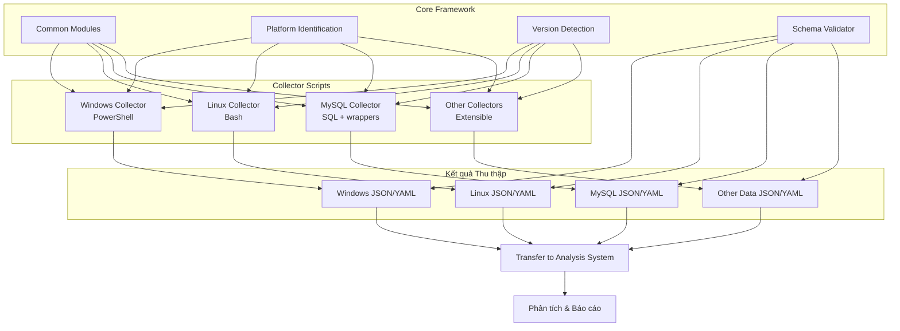

# Quy trình làm việc Collector Scripts

## Mục lục
1. [Giới thiệu](#1-giới-thiệu)
2. [Kiến trúc tổng thể](#2-kiến-trúc-tổng-thể)
3. [Chuẩn bị môi trường](#3-chuẩn-bị-môi-trường)
4. [Quy trình thu thập dữ liệu](#4-quy-trình-thu-thập-dữ-liệu)
5. [Xử lý kết quả thu thập](#5-xử-lý-kết-quả-thu-thập)
6. [Xử lý lỗi và tình huống đặc biệt](#6-xử-lý-lỗi-và-tình-huống-đặc-biệt)
7. [Kịch bản thu thập mẫu](#7-kịch-bản-thu-thập-mẫu)
8. [Hướng dẫn triển khai và đóng gói](#8-hướng-dẫn-triển-khai-và-đóng-gói)

## 1. Giới thiệu

### 1.1. Mục đích

Tài liệu này mô tả chi tiết quy trình làm việc của Collector Scripts, một thành phần trong hệ thống đánh giá CIS Benchmark với kiến trúc monolithic. Collector Scripts là các công cụ độc lập được thiết kế để thu thập thông tin cấu hình trên các hệ thống đích (Windows, Linux, MySQL) và xuất kết quả theo định dạng chuẩn hóa để phân tích sau đó.

### 1.2. Phạm vi

Quy trình này bao gồm:
- Chuẩn bị và triển khai collector scripts
- Thu thập dữ liệu trên hệ thống đích
- Xuất và xử lý kết quả thu thập
- Vận chuyển dữ liệu sang hệ thống phân tích
- Xử lý lỗi và tình huống đặc biệt

### 1.3. Đối tượng sử dụng

- **Người dùng cuối**: Quản trị viên hệ thống cần đánh giá tuân thủ CIS
- **Người phát triển**: Kỹ sư phát triển và bảo trì collector scripts
- **Người đánh giá**: Chuyên gia bảo mật thực hiện đánh giá tuân thủ

## 2. Kiến trúc tổng thể

### 2.1. Các thành phần chính



### 2.2. Nguyên tắc vận hành

1. **Độc lập**: Mỗi collector script hoạt động độc lập trên hệ thống đích, không yêu cầu kết nối mạng
2. **Không can thiệp**: Collector chỉ đọc dữ liệu, không thay đổi cấu hình hệ thống
3. **Định dạng chuẩn**: Đầu ra tuân theo schema JSON đã định nghĩa
4. **Phân tách trách nhiệm**: Thu thập dữ liệu và phân tích dữ liệu là các bước riêng biệt

### 2.3. Hỗ trợ mở rộng hệ thống

1. **Kiến trúc module**: Mỗi collector được thiết kế theo kiến trúc module để dễ dàng mở rộng
2. **Giao diện chuẩn hóa**: Tất cả collector tuân theo cùng một giao diện để đảm bảo tính nhất quán
3. **Phát triển theo plugin**: Hỗ trợ thêm mới collector mà không cần sửa đổi code hiện có
4. **Khả năng mở rộng theo chiều dọc và ngang**:
   - Chiều dọc: Thêm tính năng mới cho collector hiện có
   - Chiều ngang: Thêm collector mới cho các hệ thống khác (Network devices, Cloud platforms, etc.)

## 3. Chuẩn bị môi trường

### 3.1. Yêu cầu hệ thống

#### 3.1.1. Windows Collector
- PowerShell 2.0 trở lên (hoạt động tối ưu với 5.1+)
- Hỗ trợ các phiên bản: Windows Server 2008 R2 trở lên, Windows 7 trở lên
- Quyền Administrator để truy cập registry và cấu hình bảo mật
- Không yêu cầu cài đặt phần mềm bổ sung
- Tự động phát hiện phiên bản và điều chỉnh các lệnh PowerShell tương thích

#### 3.1.2. Linux Collector
- Tương thích POSIX shell (/bin/sh) để đảm bảo khả năng chạy trên mọi hệ thống Unix-like
- Fallback đến Bash nếu có sẵn (2.0 trở lên)
- Hỗ trợ các distro chính: RHEL/CentOS/Fedora, Debian/Ubuntu, SUSE, Amazon Linux, Alpine
- Các công cụ cơ bản thuộc coreutils: grep, awk, sed
- Phát hiện và thích ứng với các công cụ không có sẵn (jq, curl, etc.)
- Quyền root hoặc sudo để truy cập cấu hình hệ thống
- Không yêu cầu cài đặt phần mềm bổ sung

#### 3.1.3. MySQL Collector
- MySQL client (mysql command-line tool) hoặc khả năng thích ứng khi không có client
- Hỗ trợ các phiên bản: MySQL 5.5 trở lên, MariaDB 10.x
- Quyền đọc trên các bảng hệ thống của MySQL (mysql.*, information_schema.*)
- Bash (Linux) hoặc PowerShell (Windows)
- Phát hiện và điều chỉnh theo phiên bản MySQL/MariaDB

#### 3.1.4. Khả năng thích ứng hệ thống
- Tự động phát hiện môi trường (OS, version, shell)
- Kiểm tra tính tương thích trước khi chạy
- Polyfills cho các tính năng thiếu trên phiên bản cũ
- Cơ chế graceful degradation khi không có đủ công cụ

### 3.2. Cài đặt và chuẩn bị

#### 3.2.1. Trên máy đích Windows
1. Tải collector scripts package (.zip)
2. Giải nén vào thư mục tạm (ví dụ: C:\Temp\collector)
3. Kiểm tra chính sách thực thi PowerShell:
   ```powershell
   Get-ExecutionPolicy
   ```
4. Nếu cần, điều chỉnh tạm thời:
   ```powershell
   Set-ExecutionPolicy -Scope Process -ExecutionPolicy Bypass
   ```

#### 3.2.2. Trên máy đích Linux
1. Tải collector scripts package (.tar.gz)
2. Giải nén vào thư mục tạm:
   ```bash
   mkdir -p /tmp/collector
   tar -xzf collector-scripts.tar.gz -C /tmp/collector
   chmod +x /tmp/collector/*.sh /tmp/collector/*/*.sh
   ```

#### 3.2.3. Trên máy đích MySQL
1. Tải collector scripts package (phiên bản Linux hoặc Windows tùy hệ điều hành)
2. Giải nén theo hướng dẫn tương ứng
3. Chuẩn bị thông tin xác thực MySQL (tham khảo tài liệu MySQL)

## 4. Quy trình thu thập dữ liệu

### 4.1. Xác định phạm vi thu thập

Trước khi bắt đầu thu thập, xác định rõ:
- Loại hệ thống cần đánh giá (Windows/Linux/MySQL)
- Phiên bản cụ thể của hệ điều hành/database
- Phạm vi thu thập (toàn bộ modules hoặc modules cụ thể)
- Vị trí lưu kết quả thu thập

### 4.2. Thực hiện thu thập

#### 4.2.1. Windows Collector
1. Mở PowerShell với quyền Administrator
2. Di chuyển đến thư mục collector:
   ```powershell
   cd C:\Temp\collector\windows
   ```
3. Chạy script với tham số phù hợp:
   ```powershell
   .\collector.ps1 -OutputPath C:\Temp\windows_assessment.json
   ```
4. Tùy chọn bổ sung:
   ```powershell
   .\collector.ps1 -OutputPath C:\Temp\windows_assessment.json -SkipNetworkScan
   ```

#### 4.2.2. Linux Collector
1. Đăng nhập với quyền root hoặc sudo
2. Di chuyển đến thư mục collector:
   ```bash
   cd /tmp/collector/linux
   ```
3. Chạy script với tham số phù hợp:
   ```bash
   sudo ./collector.sh --output /tmp/linux_assessment.json
   ```
4. Tùy chọn bổ sung:
   ```bash
   sudo ./collector.sh --output /tmp/linux_assessment.json --skip-network
   ```

#### 4.2.3. MySQL Collector
1. Đăng nhập với quyền truy cập MySQL
2. Di chuyển đến thư mục collector:
   ```bash
   cd /tmp/collector/mysql
   ```
3. Chạy script với thông tin xác thực:
   ```bash
   ./collector.sh --output /tmp/mysql_assessment.json --user admin --password "your_password"
   ```
4. Hoặc sử dụng file cấu hình MySQL:
   ```bash
   ./collector.sh --output /tmp/mysql_assessment.json --defaults-file /path/to/my.cnf
   ```

### 4.3. Xác minh thu thập thành công

Sau khi thu thập, kiểm tra:
1. Kết quả đầu ra có tồn tại và có kích thước hợp lý
2. Không có thông báo lỗi trong quá trình thu thập
3. File kết quả có cấu trúc JSON/YAML hợp lệ:
   ```bash
   # Với Linux/macOS
   jq . /tmp/linux_assessment.json > /dev/null && echo "Valid JSON" || echo "Invalid JSON"

   # Với Windows
   Get-Content C:\Temp\windows_assessment.json | ConvertFrom-Json
   ```

## 5. Xử lý kết quả thu thập

### 5.1. Kiểm tra và làm sạch dữ liệu

1. Kiểm tra tính đầy đủ của dữ liệu:
   - Đảm bảo tất cả module bắt buộc đã được thu thập
   - Kiểm tra các trường thông tin cơ bản (`system_info`, `collection_info`)

2. Loại bỏ thông tin nhạy cảm (nếu cần):
   - Tài khoản và mật khẩu
   - Thông tin định danh cụ thể

### 5.2. Vận chuyển kết quả

#### 5.2.1. Phương pháp vận chuyển an toàn
- **Thiết bị lưu trữ di động**: USB, ổ cứng ngoài
- **Mạng nội bộ**: Sử dụng SFTP, SCP hoặc chia sẻ mạng bảo mật
- **Mã hóa**: Nén và mã hóa file trước khi vận chuyển nếu chứa dữ liệu nhạy cảm

#### 5.2.2. Quy trình vận chuyển
1. Sao chép file JSON/YAML từ hệ thống đích
2. (Tùy chọn) Nén và/hoặc mã hóa file:
   ```bash
   # Linux - Nén
   gzip /tmp/linux_assessment.json

   # Windows - Nén
   Compress-Archive -Path C:\Temp\windows_assessment.json -DestinationPath C:\Temp\windows_assessment.zip
   ```
3. Chuyển file đến hệ thống phân tích
4. Xác nhận tính toàn vẹn của file sau khi vận chuyển:
   ```bash
   # Linux
   sha256sum linux_assessment.json

   # Windows
   Get-FileHash -Algorithm SHA256 -Path C:\Temp\windows_assessment.json
   ```

### 5.3. Xử lý dữ liệu nhạy cảm

1. Loại bỏ file kết quả khỏi máy đích sau khi vận chuyển:
   ```bash
   # Linux
   shred -u /tmp/linux_assessment.json

   # Windows
   Remove-Item -Path C:\Temp\windows_assessment.json
   ```

2. Giữ quy trình lưu trữ và xử lý tuân thủ chính sách bảo mật nội bộ

## 6. Xử lý lỗi và tình huống đặc biệt

### 6.1. Xử lý lỗi phổ biến

| Loại lỗi | Nguyên nhân | Giải pháp |
|----------|-------------|-----------|
| Quyền truy cập | Không đủ quyền để đọc cấu hình | Chạy với quyền Administrator/root/sudo |
| Không tìm thấy tài nguyên | File, directory hoặc registry key không tồn tại | Kiểm tra phiên bản OS và sử dụng alternative paths |
| Lỗi xác thực | Thông tin đăng nhập MySQL không chính xác | Kiểm tra lại username/password hoặc file cấu hình |
| Lỗi network timeout | Không thể kết nối đến MySQL | Kiểm tra kết nối mạng, firewall và MySQL running status |
| Lỗi JSON | Không thể tạo hoặc format JSON | Sử dụng native JSON generator hoặc text-based fallback |
| Lỗi tương thích | Lệnh không tương thích với phiên bản OS | Sử dụng cơ chế phát hiện phiên bản và alternative commands |

### 6.2. Log và debug

1. Bật chế độ verbose cho troubleshooting:
   ```bash
   # Linux
   ./collector.sh --output /tmp/linux_assessment.json --verbose

   # Windows
   .\collector.ps1 -OutputPath C:\Temp\windows_assessment.json -Verbose
   ```

2. Lưu log vào file riêng:
   ```bash
   # Linux
   ./collector.sh --output /tmp/linux_assessment.json --log /tmp/collector.log

   # Windows
   .\collector.ps1 -OutputPath C:\Temp\windows_assessment.json -LogPath C:\Temp\collector.log
   ```

3. Cấp độ log chi tiết:
   ```bash
   # Linux (cấp độ: info, warning, error, debug)
   ./collector.sh --output /tmp/linux_assessment.json --log-level debug

   # Windows
   .\collector.ps1 -OutputPath C:\Temp\windows_assessment.json -LogLevel Debug
   ```

### 6.3. Tiếp cận từng phần

Nếu quá trình thu thập đầy đủ gặp vấn đề:

1. Thu thập từng module riêng biệt:
   ```bash
   # Linux - chỉ thu thập filesystem
   ./collector.sh --output /tmp/linux_filesystem.json --module filesystem

   # Windows - chỉ thu thập user accounts
   .\collector.ps1 -OutputPath C:\Temp\windows_users.json -Module Users
   ```

2. Kết hợp kết quả sau khi thu thập thành công các module

### 6.4. Cơ chế tương thích đa phiên bản

1. **Phát hiện phiên bản OS**:
   ```bash
   # Linux - Phát hiện distro và phiên bản
   if [ -f /etc/os-release ]; then
       . /etc/os-release
       DISTRO=$ID
       VERSION=$VERSION_ID
   elif [ -f /etc/redhat-release ]; then
       DISTRO="rhel"
   fi

   # Điều chỉnh lệnh theo phiên bản
   if [ "$DISTRO" = "ubuntu" ] && [ "${VERSION_ID%.*}" -lt 18 ]; then
       # Sử dụng lệnh tương thích với Ubuntu < 18.04
   else
       # Sử dụng lệnh hiện đại
   fi
   ```

   ```powershell
   # Windows - Phát hiện phiên bản
   $OSVersion = [System.Environment]::OSVersion.Version

   # Điều chỉnh lệnh theo phiên bản
   if ($OSVersion.Major -lt 6 -or ($OSVersion.Major -eq 6 -and $OSVersion.Minor -lt 1)) {
       # Windows 7/2008 R2 hoặc cũ hơn
       # Sử dụng lệnh tương thích
   } else {
       # Windows 8/2012 hoặc mới hơn
       # Sử dụng lệnh hiện đại
   }
   ```

2. **Kiểm tra tính khả dụng của lệnh**:
   ```bash
   # Linux - Kiểm tra lệnh có tồn tại không
   check_command() {
       command -v "$1" >/dev/null 2>&1
   }

   # Sử dụng lệnh thay thế nếu cần
   if check_command jq; then
       # Xử lý JSON với jq
   else
       # Fallback xử lý JSON bằng grep/sed/awk
   fi
   ```

3. **Polyfills cho tính năng thiếu**:
   ```bash
   # Linux - Base64 encode polyfill
   if check_command base64; then
       base64_encode() { base64; }
   else
       base64_encode() {
           # Polyfill implementation
           od -A n -t x1 | tr -d '[\n ]' | tr '[:lower:]' '[:upper:]'
       }
   fi
   ```

   ```powershell
   # Windows - ConvertTo-Json polyfill cho PowerShell cũ
   if (-not (Get-Command ConvertTo-Json -ErrorAction SilentlyContinue)) {
       function ConvertTo-Json {
           param([Parameter(ValueFromPipeline=$true)][object]$InputObject)
           # Polyfill implementation
       }
   }
   ```

## 7. Kịch bản thu thập mẫu

### 7.1. Kịch bản thu thập Windows Server

```powershell
# 1. Chuẩn bị môi trường
# Tạo thư mục làm việc
New-Item -Path "C:\Temp\CISAssessment" -ItemType Directory -Force
cd C:\Temp\CISAssessment

# 2. Tải và giải nén collector
# Giả định collector đã được tải về C:\Downloads\collector-win.zip
Expand-Archive -Path "C:\Downloads\collector-win.zip" -DestinationPath "."

# 3. Đặt execution policy cho phiên hiện tại
Set-ExecutionPolicy -Scope Process -ExecutionPolicy Bypass -Force

# 4. Thu thập thông tin Windows
Write-Host "Starting Windows configuration assessment..." -ForegroundColor Cyan
.\windows\collector.ps1 -OutputPath ".\windows_assessment.json" -Verbose

# 5. Nếu máy chủ cũng chạy MySQL, thu thập thông tin MySQL
if (Get-Service -Name "MySQL*" -ErrorAction SilentlyContinue) {
    Write-Host "MySQL detected, collecting MySQL configuration..." -ForegroundColor Cyan
    .\mysql\collector.ps1 -OutputPath ".\mysql_assessment.json" -User "root" -Password "your_password"
}

# 6. Nén kết quả
Write-Host "Compressing results..." -ForegroundColor Cyan
Compress-Archive -Path ".\*_assessment.json" -DestinationPath ".\assessment_results.zip" -Force

# 7. Hiển thị thông tin hoàn thành
Write-Host "Assessment complete. Results saved to: $((Get-Item .\assessment_results.zip).FullName)" -ForegroundColor Green
Write-Host "Please transfer this file to your analysis system."
```

### 7.2. Kịch bản thu thập Linux Server

```bash
#!/bin/bash
# Script thu thập Linux Server

# 1. Chuẩn bị môi trường
echo -e "\e[36mSetting up environment...\e[0m"
WORK_DIR="/tmp/CISAssessment"
mkdir -p $WORK_DIR
cd $WORK_DIR

# 2. Tải và giải nén collector (giả định đã tải về /tmp/collector-linux.tar.gz)
echo -e "\e[36mExtracting collector scripts...\e[0m"
tar -xzf /tmp/collector-linux.tar.gz
chmod +x ./*/*.sh

# 3. Thu thập thông tin Linux
echo -e "\e[36mStarting Linux configuration assessment...\e[0m"
sudo ./linux/collector.sh --output ./linux_assessment.json --verbose

# 4. Nếu máy chủ cũng chạy MySQL, thu thập thông tin MySQL
if systemctl is-active --quiet mysql || systemctl is-active --quiet mysqld; then
    echo -e "\e[36mMySQL detected, collecting MySQL configuration...\e[0m"
    # Yêu cầu thông tin đăng nhập MySQL
    read -p "Enter MySQL username: " MYSQL_USER
    read -sp "Enter MySQL password: " MYSQL_PASS
    echo ""

    ./mysql/collector.sh --output ./mysql_assessment.json --user "$MYSQL_USER" --password "$MYSQL_PASS"
fi

# 5. Nén kết quả
echo -e "\e[36mCompressing results...\e[0m"
tar -czf assessment_results.tar.gz *_assessment.json

# 6. Hiển thị thông tin hoàn thành
echo -e "\e[32mAssessment complete. Results saved to: $(realpath assessment_results.tar.gz)\e[0m"
echo "Please transfer this file to your analysis system."
```

### 7.3. Kịch bản thu thập MySQL Database

```bash
#!/bin/bash
# Script thu thập MySQL Database

# 1. Chuẩn bị môi trường
echo -e "\e[36mSetting up environment...\e[0m"
WORK_DIR="/tmp/CISAssessment"
mkdir -p $WORK_DIR
cd $WORK_DIR

# 2. Tải và giải nén collector (giả định đã tải về /tmp/collector-mysql.tar.gz)
echo -e "\e[36mExtracting collector scripts...\e[0m"
tar -xzf /tmp/collector-mysql.tar.gz
chmod +x ./*/*.sh

# 3. Thu thập thông tin hệ điều hành nếu cần
echo -e "\e[36mWould you like to collect OS information as well? (y/n)\e[0m"
read collect_os
if [[ "$collect_os" == "y" || "$collect_os" == "Y" ]]; then
    echo -e "\e[36mStarting OS configuration assessment...\e[0m"
    sudo ./linux/collector.sh --output ./linux_assessment.json
fi

# 4. Thu thập thông tin MySQL
echo -e "\e[36mStarting MySQL configuration assessment...\e[0m"
# Yêu cầu thông tin đăng nhập MySQL
read -p "Enter MySQL username: " MYSQL_USER
read -sp "Enter MySQL password: " MYSQL_PASS
echo ""
read -p "Enter MySQL host [localhost]: " MYSQL_HOST
MYSQL_HOST=${MYSQL_HOST:-localhost}
read -p "Enter MySQL port [3306]: " MYSQL_PORT
MYSQL_PORT=${MYSQL_PORT:-3306}

./mysql/collector.sh --output ./mysql_assessment.json --user "$MYSQL_USER" --password "$MYSQL_PASS" --host "$MYSQL_HOST" --port "$MYSQL_PORT"

# 5. Nén kết quả
echo -e "\e[36mCompressing results...\e[0m"
tar -czf mysql_assessment_results.tar.gz *_assessment.json

# 6. Hiển thị thông tin hoàn thành
echo -e "\e[32mAssessment complete. Results saved to: $(realpath mysql_assessment_results.tar.gz)\e[0m"
echo "Please transfer this file to your analysis system."
```

## 8. Hướng dẫn triển khai và đóng gói

### 8.1. Cấu trúc thư mục đóng gói

```
collector-scripts/
├── README.md
├── LICENSE
├── collector.sh              # Unix wrapper script (POSIX compatible)
├── collector.bat             # Windows wrapper script
├── common/                   # Common framework components
│   ├── schema_validator.sh   # JSON schema validator (POSIX)
│   ├── schema_validator.ps1  # JSON schema validator (PowerShell)
│   ├── version_detector.sh   # OS version detection (POSIX)
│   ├── version_detector.ps1  # OS version detection (PowerShell)
│   └── extension_manager.sh  # Plugin management (POSIX)
├── windows/
│   ├── collector.ps1
│   ├── modules/
│   │   ├── filesystem.ps1
│   │   ├── registry.ps1
│   │   └── ...
│   ├── utils/
│   │   ├── json_formatter.ps1
│   │   ├── compatibility.ps1  # Compatibility functions
│   │   └── ...
│   └── extensions/           # Plugin directory for extensions
├── linux/
│   ├── collector.sh          # POSIX compatible script
│   ├── modules/
│   │   ├── filesystem.sh
│   │   ├── kernel_modules.sh
│   │   └── ...
│   ├── utils/
│   │   ├── json_formatter.sh
│   │   ├── compatibility.sh  # POSIX compatibility layer
│   │   └── ...
│   └── extensions/           # Plugin directory for extensions
├── mysql/
│   ├── collector.sql
│   ├── collector.sh
│   ├── collector.ps1
│   └── extensions/           # Database-specific extensions
└── templates/                # Templates for new collector development
    ├── new_collector.sh      # POSIX template
    ├── new_collector.ps1     # PowerShell template
    └── README.md             # Extension development guide
```

### 8.2. Tiêu chuẩn phát triển

#### 8.2.1. Tiêu chuẩn phát triển Shell Script

1. **Tuân thủ POSIX Shell**:
   - Chỉ sử dụng các tính năng có trong tiêu chuẩn POSIX sh
   - Tránh sử dụng các tính năng đặc thù của bash, zsh, ksh
   - Sử dụng `#!/bin/sh` thay vì `#!/bin/bash`
   - Kiểm tra tuân thủ POSIX với công cụ như ShellCheck

2. **Quy tắc bắt buộc**:
   - Xử lý lỗi: Kiểm tra giá trị trả về của lệnh
   - Đặt trong dấu ngoặc kép các biến: `"$variable"`
   - Sử dụng `command -v` thay vì `which`
   - Tránh sử dụng `$[...]` hoặc `let` cho phép tính
   - Sử dụng `$(command)` thay vì dấu backticks
   - Ưu tiên `printf` hơn `echo` cho output có định dạng

3. **Tương thích đa nền tảng**:
   - Kiểm tra tồn tại của lệnh trước khi sử dụng
   - Cung cấp fallbacks cho các lệnh không tồn tại
   - Sử dụng `sed -E` với escaping phù hợp
   - Tránh các tùy chọn GNU-specific cho các lệnh cơ bản

#### 8.2.2. Tiêu chuẩn phát triển PowerShell

1. **Tương thích đa phiên bản**:
   - Sử dụng cú pháp tương thích với PowerShell 2.0+
   - Kiểm tra phiên bản trước khi sử dụng tính năng mới
   - Cung cấp polyfills cho các cmdlet thiếu trong phiên bản cũ

2. **Quy tắc bắt buộc**:
   - Sử dụng các tham số có tên và mô tả rõ ràng
   - Xử lý lỗi với try/catch hoặc kiểm tra $? sau mỗi lệnh
   - Tuân thủ các quy ước đặt tên của PowerShell
   - Sử dụng ErrorAction và WarningAction phù hợp

3. **Tối ưu cho nhiều phiên bản Windows**:
   - Kiểm tra sự tồn tại của registry key trước khi truy cập
   - Sử dụng các đường dẫn tương đối với %SystemRoot%
   - Xử lý đúng đắn Unicode và encoding

### 8.3. Hướng dẫn mở rộng

#### 8.3.1. Cấu trúc phần mở rộng

Mỗi extension phải có cấu trúc như sau:
```
extensions/
├── extension_name/
│   ├── manifest.json      # Metadata về extension
│   ├── collector.sh       # POSIX script (Linux)
│   ├── collector.ps1      # PowerShell script (Windows)
│   ├── schema.json        # JSON Schema cho output
│   └── README.md          # Tài liệu hướng dẫn
```

#### 8.3.2. Phát triển collector mới

1. **Sử dụng template**:
   ```bash
   # Linux
   ./create_extension.sh --name "network_devices" --type "cisco"

   # Windows
   .\create_extension.ps1 -Name "network_devices" -Type "cisco"
   ```

2. **Quy trình phát triển**:
   - Học tập cấu trúc từ template
   - Implement các hàm thu thập dữ liệu chính
   - Tuân thủ schema đầu ra chuẩn
   - Kiểm tra tương thích POSIX/đa phiên bản
   - Viết unit tests
   - Tạo tài liệu hướng dẫn

3. **Tích hợp extension**:
   ```bash
   # Linux
   ./extension_manager.sh --install ./extensions/network_devices

   # Windows
   .\extension_manager.ps1 -Install .\extensions\network_devices
   ```

### 8.4. Hướng dẫn đóng gói

#### 8.4.1. Tạo package cho Windows
```powershell
# Tạo thư mục làm việc
$PackageDir = "collector-win"
New-Item -Path $PackageDir -ItemType Directory -Force

# Sao chép các file cần thiết
Copy-Item -Path ".\common\*" -Destination "$PackageDir\common\" -Include *.ps1
Copy-Item -Path ".\windows\*" -Destination "$PackageDir\windows\" -Recurse
Copy-Item -Path ".\mysql\*" -Destination "$PackageDir\mysql\" -Recurse -Include *.ps1,*.sql
Copy-Item -Path "collector.bat" -Destination $PackageDir
Copy-Item -Path "README.md" -Destination $PackageDir

# Tạo file zip
Compress-Archive -Path "$PackageDir\*" -DestinationPath "collector-windows.zip" -Force
```

#### 8.4.2. Tạo package cho Linux
```bash
#!/bin/bash
# Tạo thư mục làm việc
PACKAGE_DIR="collector-linux"
mkdir -p $PACKAGE_DIR

# Sao chép các file cần thiết
cp -r ./common $PACKAGE_DIR/
cp -r ./linux $PACKAGE_DIR/
cp -r ./mysql $PACKAGE_DIR/
cp collector.sh $PACKAGE_DIR/
cp README.md $PACKAGE_DIR/

# Kiểm tra POSIX compatibility
echo "Checking POSIX compatibility..."
find $PACKAGE_DIR -name "*.sh" -type f -exec shellcheck -s sh {} \;

# Tạo file tar.gz
tar -czf collector-linux.tar.gz -C $PACKAGE_DIR .
```

### 8.5. Các bước triển khai

1. **Chuẩn bị**:
   - Xác định loại hệ thống cần đánh giá
   - Chuẩn bị package collector phù hợp
   - Đảm bảo quyền truy cập phù hợp

2. **Triển khai**:
   - Chuyển package collector đến hệ thống đích
   - Giải nén package vào thư mục làm việc
   - Cấp quyền thực thi cho scripts

3. **Thực hiện**:
   - Chạy collector script phù hợp
   - Theo dõi quá trình thu thập
   - Xử lý lỗi nếu có

4. **Hoàn thành**:
   - Kiểm tra kết quả thu thập
   - Chuyển kết quả về hệ thống phân tích
   - Xóa dữ liệu tạm trên hệ thống đích

### 8.6. Kiểm thử đa nền tảng

#### 8.6.1. Test Matrix

| Hệ thống | Phiên bản | Shell/PowerShell | Mức độ hỗ trợ |
|----------|-----------|------------------|---------------|
| RHEL/CentOS | 6.x, 7.x, 8.x, 9.x | sh, bash | Đầy đủ |
| Debian | 9, 10, 11, 12 | sh, dash, bash | Đầy đủ |
| Ubuntu | 16.04, 18.04, 20.04, 22.04, 24.04 | sh, dash, bash | Đầy đủ |
| SUSE | 12, 15 | sh, bash | Đầy đủ |
| Alpine | 3.x | sh, ash | Hạn chế |
| Windows | 2008 R2, 2012, 2012 R2, 2016, 2019, 2022 | PowerShell 2.0-7.x | Đầy đủ |
| Windows | 7, 8.1, 10, 11 | PowerShell 2.0-7.x | Đầy đủ |
| MySQL | 5.5, 5.6, 5.7, 8.0 | - | Đầy đủ |
| MariaDB | 10.x | - | Đầy đủ |

#### 8.6.2. CI/CD Pipeline

Tự động hóa kiểm thử trên các nền tảng khác nhau bằng:
- Docker containers cho Linux variants
- Windows VM với các phiên bản khác nhau
- MySQL/MariaDB containers với các phiên bản khác nhau

### 8.7. Lịch trình phát triển và cập nhật

- **Phát hành**: Phát hành phiên bản mới mỗi quý (3 tháng)
- **Hot-fix**: Sửa lỗi nghiêm trọng trong vòng 1-2 tuần
- **Đánh giá làm mới**: Cập nhật script theo CIS benchmarks mới
- **Extension mới**: Phát hành theo lịch trình riêng

### 8.8. Hiệu suất và giới hạn

- **Thời gian thu thập trung bình**:
  - Windows Server: 2-5 phút
  - Linux Server: 1-3 phút
  - MySQL Database: 30 giây - 2 phút

- **Giới hạn**:
  - Kích thước output: Thông thường 1-5MB tùy hệ thống
  - Khả năng xử lý: Lên đến 1000 services, 10000 registry keys

## 9. Tiêu chuẩn mã nguồn và kiểm thử

### 9.1. Tiêu chuẩn mã nguồn

#### 9.1.1. Shell Scripts (POSIX)

- **Kiểm tra POSIX compliance:**
  - Sử dụng ShellCheck với tùy chọn `-s sh`
  - Sử dụng checkbashisms trên các scripts
  - Kiểm tra trên các shell khác nhau (dash, ash, ksh)

- **Phong cách mã nguồn:**
  ```bash
  #!/bin/sh
  # Tên tệp: example.sh
  # Mô tả: Thu thập thông tin về kernel modules
  # Tác giả: Họ tên
  # Ngày cập nhật: 2025-03-14

  # Hằng số và cấu hình
  MODULE_CONF_DIR="/etc/modprobe.d"
  OUTPUT_FORMAT="json"

  # Biến toàn cục - giảm thiểu sử dụng
  result=""

  # Hàm helpers - đặt tên rõ ràng với snake_case
  is_module_loaded() {
      module_name="$1"
      if grep -q "^$module_name " /proc/modules 2>/dev/null; then
          return 0 # true
      else
          return 1 # false
      fi
  }

  # Xử lý lỗi và thoát
  handle_error() {
      error_message="$1"
      echo "ERROR: $error_message" >&2
      exit 1
  }

  # Kiểm tra môi trường
  [ -d "$MODULE_CONF_DIR" ] || handle_error "Module configuration directory not found"

  # Hàm chính
  main() {
      # Xử lý tham số
      while [ $# -gt 0 ]; do
          case "$1" in
              --format=*)
                  OUTPUT_FORMAT="${1#*=}"
                  ;;
              *)
                  handle_error "Unknown parameter: $1"
                  ;;
          esac
          shift
      done

      # Thu thập dữ liệu
      # ...

      # Trả về kết quả
      echo "$result"
      return 0
  }

  # Chạy script
  main "$@"
  ```

#### 9.1.2. PowerShell Scripts

- **PowerShell Code Style:**
  ```powershell
  <#
  .SYNOPSIS
      Thu thập thông tin về Windows services.
  .DESCRIPTION
      Script thu thập thông tin chi tiết về các Windows services.
  .NOTES
      Tác giả: Họ tên
      Ngày cập nhật: 2025-03-14
  #>
  [CmdletBinding()]
  param (
      [Parameter(Mandatory=$false)]
      [string]$OutputPath = "services.json",

      [Parameter(Mandatory=$false)]
      [ValidateSet("JSON", "YAML")]
      [string]$OutputFormat = "JSON"
  )

  # Hàm helpers - PascalCase cho hàm
  function Test-AdminPrivileges {
      $identity = [System.Security.Principal.WindowsIdentity]::GetCurrent()
      $principal = New-Object System.Security.Principal.WindowsPrincipal($identity)
      return $principal.IsInRole([System.Security.Principal.WindowsBuiltInRole]::Administrator)
  }

  # Xử lý lỗi
  function Write-ErrorAndExit {
      param([string]$ErrorMessage)
      Write-Error $ErrorMessage
      exit 1
  }

  # Kiểm tra môi trường
  if (-not (Test-AdminPrivileges)) {
      Write-ErrorAndExit "This script requires administrator privileges"
  }

  # Đảm bảo tương thích đa phiên bản
  $PSVersionTable.PSVersion
  if ($PSVersionTable.PSVersion.Major -lt 3) {
      Write-Host "Running in PowerShell compatibility mode"
      # Polyfills cho các cmdlet không có trong PowerShell 2.0
  }

  # Phần chính
  try {
      # Thu thập dữ liệu
      $services = Get-Service

      # Xử lý và lưu kết quả
      $result = $services | Select-Object Name, DisplayName, Status, StartType

      if ($OutputFormat -eq "JSON") {
          # Tương thích đa phiên bản
          if (Get-Command ConvertTo-Json -ErrorAction SilentlyContinue) {
              $result | ConvertTo-Json | Out-File -FilePath $OutputPath -Encoding UTF8
          } else {
              # Polyfill cho ConvertTo-Json
              $jsonResult = ConvertTo-JsonPolyfill -InputObject $result
              Set-Content -Path $OutputPath -Value $jsonResult -Encoding UTF8
          }
      } else {
          # Output YAML
          # ...
      }

      Write-Host "Service information collected successfully"
  } catch {
      Write-ErrorAndExit "Error collecting service information: $_"
  }
  ```

### 9.2. Kiểm thử

#### 9.2.1. Unit Testing

- **Linux Shell Scripts:**
  ```bash
  #!/bin/sh
  # test_filesystem_module.sh

  # Import module to test
  . ./modules/filesystem.sh

  # Setup test environment
  setup() {
      mkdir -p /tmp/test_dir
      echo "test content" > /tmp/test_dir/test_file
      chmod 644 /tmp/test_dir/test_file
  }

  # Teardown test environment
  teardown() {
      rm -rf /tmp/test_dir
  }

  # Define tests
  test_get_file_permissions() {
      # Act
      result=$(get_file_permissions "/tmp/test_dir/test_file")

      # Assert
      echo "$result" | grep -q "owner"
      if [ $? -ne 0 ]; then
          echo "FAIL: get_file_permissions should return owner information"
          return 1
      fi

      echo "PASS: get_file_permissions works correctly"
      return 0
  }

  # Run tests
  run_tests() {
      setup

      # Run each test
      test_get_file_permissions
      test_result=$?

      teardown

      # Return overall result
      return $test_result
  }

  run_tests
  exit $?
  ```

- **Windows PowerShell:**
  ```powershell
  # test_registry_module.ps1

  # Import module to test
  . .\modules\registry.ps1

  # Setup test environment
  function Setup-TestEnvironment {
      $testKey = "HKCU:\Software\TestRegistry"
      if (-not (Test-Path $testKey)) {
          New-Item -Path $testKey -Force | Out-Null
      }
      New-ItemProperty -Path $testKey -Name "TestValue" -Value "TestData" -PropertyType String -Force | Out-Null
      return $testKey
  }

  # Teardown test environment
  function Teardown-TestEnvironment {
      param([string]$TestKey)
      Remove-Item -Path $TestKey -Force -Recurse -ErrorAction SilentlyContinue
  }

  # Define tests
  function Test-GetRegistryValue {
      # Arrange
      $testKey = Setup-TestEnvironment

      # Act
      $result = Get-RegistryValue -Path $testKey -Name "TestValue"

      # Assert
      if ($result -ne "TestData") {
          Write-Host "FAIL: Get-RegistryValue should return 'TestData', got '$result'"
          return $false
      }

      Write-Host "PASS: Get-RegistryValue works correctly"
      Teardown-TestEnvironment -TestKey $testKey
      return $true
  }

  # Run tests
  $testsPassed = $true
  if (-not (Test-GetRegistryValue)) {
      $testsPassed = $false
  }

  # Return overall result
  if ($testsPassed) {
      Write-Host "All tests passed!"
      exit 0
  } else {
      Write-Host "Some tests failed!"
      exit 1
  }
  ```

#### 9.2.2. Integration Testing

- **Linux End-to-end tests:**
  ```bash
  #!/bin/sh
  # integration_test.sh

  # Run collector and check output
  test_collector_e2e() {
      # Run collector
      ./collector.sh --output /tmp/test_assessment.json

      # Check if output exists
      if [ ! -f /tmp/test_assessment.json ]; then
          echo "FAIL: Output file was not created"
          return 1
      fi

      # Validate JSON structure
      if command -v jq >/dev/null 2>&1; then
          jq . /tmp/test_assessment.json >/dev/null 2>&1
          if [ $? -ne 0 ]; then
              echo "FAIL: Output is not valid JSON"
              return 1
          fi
      fi

      # Check required sections
      grep -q "system_info" /tmp/test_assessment.json
      if [ $? -ne 0 ]; then
          echo "FAIL: Missing required 'system_info' section"
          return 1
      fi

      # More checks...

      echo "PASS: Collector produces valid output"
      return 0
  }

  # Run integration tests
  test_collector_e2e
  exit $?
  ```

#### 9.2.3. Cross-platform Testing

Automated testing matrix using containers and VMs:

```yaml
# .github/workflows/test.yml (GitHub Actions example)
name: Test Collectors

on:
  push:
    branches: [ main, develop ]
  pull_request:
    branches: [ main, develop ]

jobs:
  test-linux:
    runs-on: ubuntu-latest
    strategy:
      matrix:
        container: [
          'ubuntu:18.04',
          'ubuntu:20.04',
          'ubuntu:22.04',
          'centos:7',
          'rockylinux:8',
          'debian:10',
          'debian:11',
          'alpine:3.15'
        ]
    container:
      image: ${{ matrix.container }}
    steps:
      - uses: actions/checkout@v2
      - name: Install prerequisites
        run: |
          if command -v apt-get >/dev/null 2>&1; then
            apt-get update && apt-get install -y shellcheck
          elif command -v yum >/dev/null 2>&1; then
            yum install -y epel-release && yum install -y shellcheck
          elif command -v apk >/dev/null 2>&1; then
            apk add --no-cache shellcheck
          fi
      - name: Verify POSIX compliance
        run: |
          find ./linux -name "*.sh" -type f -exec shellcheck -s sh {} \;
      - name: Run unit tests
        run: |
          cd ./tests/linux && ./run_tests.sh
      - name: Run collector
        run: |
          ./collector.sh --output /tmp/assessment.json

  test-windows:
    runs-on: ${{ matrix.os }}
    strategy:
      matrix:
        os: [windows-2019, windows-2022]
    steps:
      - uses: actions/checkout@v2
      - name: Run PowerShell analyzer
        run: |
          Install-Module -Name PSScriptAnalyzer -Force
          Invoke-ScriptAnalyzer -Path .\windows
      - name: Run unit tests
        run: |
          cd .\tests\windows
          .\run_tests.ps1
      - name: Run collector
        run: |
          .\collector.bat -OutputPath $env:TEMP\assessment.json
```

---

**Phiên bản tài liệu**: 1.1.0
**Ngày cập nhật**: 14/03/2025
**Người biên soạn**: [Tên người biên soạn]
**Phê duyệt bởi**: [Tên người phê duyệt]
